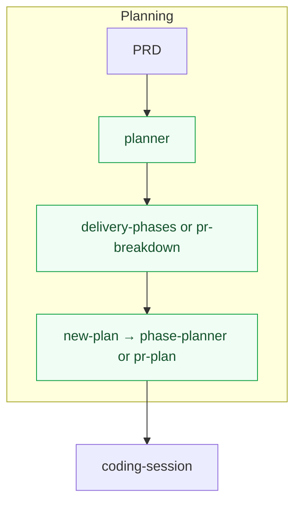
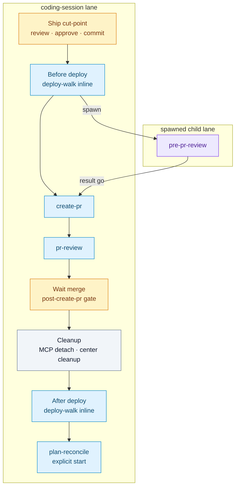
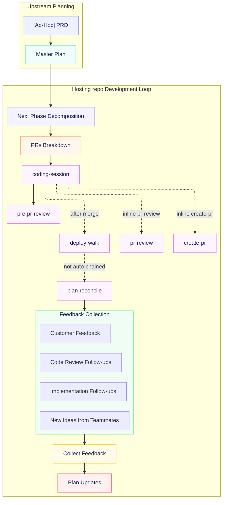

# Sedea's New Feature Development Process

## Overview

This is a document describing how developers deliver new features from idea to production. It is structured in four layers, captured in this order:

1. **Strategy** — the underlying principles that govern every decision.
2. **Development tools** - A surface of missions, protocol branches, agents, and workbench host capabilities that is used to deliver artifacts - designs, plans and hosting repo code.
3. **Planning Modes** — the three modes planning passes through, applied top-down (*architectural / code design* → *delivery phases* → *PR breakdown*), each with a plan-file template and notes on how the template shifts across hierarchy levels (feature-level plan, delivery phase plan, etc.). A **PRD** (Product or Feature Requirements Document) is upstream input to the one-shot **Master Plan** in mode #1; it is not a separate planning mode.
4. **Cadence** — the continuous loop that wraps the modes once delivery starts: phase decomposition → PRs breakdown → work session → feedback collection → plan updates → next phase. Each iteration may update *any* plan in the hierarchy, depending on the feedback's nature.

**Naming.** **Master Plan** is this document's term for the feature-level plan at the top of a feature's plan tree — the artifact mode #1's **Master Plan** template (below) produces. It is the single source of truth for the feature; phases, PRs, and child plans all hang off it.

## Strategy

The six principles below are the non-negotiables. Everything in **Planning Modes** and **Cadence** below must be consistent with them.

1. **Top-down granularity.** Planning moves from the highest, least-granular level down to the lowest, most-granular level. We never start from a PR.
2. **Three planning modes.** Planning happens in three modes, applied top-down:
 - *Architectural / code design* — what the shape of the solution is.
 - *Delivery phases* — how that shape decomposes on its way to delivery (a phase is never delivered directly — it splits further into sub-phases or into PRs).
 - *PR breakdown* — how a **PR-ready plan** (a phase plan decided not to decompose further, or a Master Plan small enough to skip the phase layer) breaks into individual, coding-ready PRs. Optional and partial: only PR-ready plans go through this mode.
3. **Each level has its own set of plans.** A planning level in the hierarchy is not a single document; it is a set of plans that share that level's granularity.
4. **Small chunks, fast to production.** We plan and deliver small chunks of work. Chunks that are ready ship to production as soon as possible — we do not batch.
5. **Forward planning is partial by design.** We do not require everything to be planned before the first chunks go out. Later levels are planned just-in-time as earlier chunks land.
6. **Single concern per deliverable.** Every deliverable chunk follows the single-concern principle — one purpose, one reason to change, one PR's worth of intent.

**Desired outcome.** Living by these principles, we ship a steady stream of small PRs that are easy for both a human developer reviewer and **a reviewer agent** to review, and whose impact on production execution is easy to reason about. The issues that do reach production are correspondingly small in scope and easy to fix. As a result we are always confident that the production system is robust and stable — every production issue we currently have is temporary and easy to fix.

## Development tools

Single catalogue of **what we use** in this process. Later sections still spell out **agent roles** wherever a role appears (e.g. **a coding agent**) so a developer reader scanning a template never has to chase definitions.

### Center and mission governance

This center does **not** ship **`missions/<missionSlug>/rules/*.mdc`** for **`plan-and-deliver`** or **`prd`**. That is **intentional**, not incomplete setup. Sedea treats mission rules as **optional** (see **`.sedea/centers/sedea/rules/4_mission.mdc`** § *Rules* — absence is normal).

Software Development delivery agents are governed by:

- **Center rules** — `.sedea/centers/software-development/rules/`
- **Mission plans** — `missions/<missionSlug>/plan.mdc`
- **Skills** — `missions/<missionSlug>/skills/` and the **Protocol branches** table below

**Lane warm-up manifest contract.** Per-lane warm-up semantics (`bootstrapRules`, `laneRules`, `skillWarmUp`, `effectiveWarmUp`, reload obligations) are normative in **`.sedea/centers/sedea/docs/lane-manifest-contract.md`**, with spawn/reload bindings in **`.sedea/centers/sedea/rules/4_mission.mdc`** § *Lane warm-up manifest (spawn and reload)*. Software Development plans and skills should reference that contract when declaring role-specific **`laneRules`**.

| Layer | Software Development dispatch path |
|-------|-------------------|
| **Sedea `bootstrapRules`** | **`.sedea/centers/sedea/rules/bootstrap.mdc`** (sole Sedea `alwaysApply: true` bootstrap) |
| **Software Development `bootstrapRules`** | **`.sedea/centers/software-development/rules/bootstrap.mdc`** — sole Software Development `alwaysApply: true` bootstrap (≤10 KB); documented in skill warm-up manifest **`bootstrapRules`** tables and **`.sedea/centers/software-development/missions/plan-and-deliver/skills/README.md`** § *Definitive `bootstrapRules`* |
| **`laneRules`** | Role minimums in **`skills/README.md`** § *Definitive `laneRules`* and skill frontmatter |
| **`skillWarmUp`** | Skill frontmatter **`warmUpRules`** + optional spawn **`warmUpRules`** |

Do not flip numbered Software Development rule **`alwaysApply`** frontmatter until the host Software Development resolver and parity gate ship (reduce-alwaysapply-governance-load PRD §5.4 phase 6 sequencing). Sedea center **`alwaysApply`** flip is governed separately (PRD §5.3).

**Audits and gap reports** must **not** flag missing mission-level rule files under this center. To change **this center's** process or rules, use **`improve center rules`** on **`software-development`** (`center-maintenance` on the **sedea** center). For **Sedea platform** governance (hosting layout, git gate, Safeguard), use **`improve center rules`** on **`sedea`**. To change **repo** agent guidance in a hosting repo, use **`.cursor/rules/*.mdc`** per **`.sedea/centers/software-development/rules/40_maintain-rules.mdc`** and per-PR plan **§ 5. Repo rules impact**.

### Development tools index (on-demand detail)

Subsections below are **indexes** — load linked rules, skills, or on-demand docs at the protocol step that needs them. **Do not** duplicate full prose here after the Phase C slim split.

| Topic | Load when |
| --- | --- |
| Center submodule git (two repos) | [`.sedea/centers/sedea/rules/3_center.mdc`](.sedea/centers/sedea/rules/3_center.mdc) § *Git repo semantics*; [`promote-submodule-pin`](.sedea/centers/sedea/skills/promote-submodule-pin/SKILL.md) after center merge (promote scripts use **`worktree-setup.sh --pin-only`**); § *Center-repo PR base (binding)* below for **`--base`** |
| Git governance (worktree-only) | [`.sedea/centers/software-development/rules/20_efficient-pr-shipping.mdc`](../rules/20_efficient-pr-shipping.mdc); Sedea rules **0**, **6**, **7** |
| Governance scripts / CI | `./scripts/verify-center-governance.sh` on hosting repo; [`.github/workflows/center-governance.yml`](../.github/workflows/center-governance.yml) on this center repo |
| PRD routing | **`plan-and-deliver/plan.mdc`** §§2–3; **`author-prd/SKILL.md`** |
| Brainstorm pre-intake | **`brainstorm-research/SKILL.md`**; invoker mission **`plan.mdc`** §2.5 |
| Mission routing (expedited paths) | Each mission **`plan.mdc`**; hub **`mission.yaml`** |
| Root delivery / Hub parent sunset | **`plan-and-deliver/plan.mdc`** §4; rule **30** § *Root delivery plans only* |
| Operations plan writer notes | [`.sedea/centers/sedea/rules/8_operations-plan-sidecar-contract.mdc`](.sedea/centers/sedea/rules/8_operations-plan-sidecar-contract.mdc) |
| GitHub issue dispatch closure | [`.sedea/centers/software-development/rules/60_github-issue-dispatch-closure.mdc`](../rules/60_github-issue-dispatch-closure.mdc) |
| Agent UX pitfalls (mis-runs) | [`spawn-ship-contracts.md`](../missions/plan-and-deliver/docs/spawn-ship-contracts.md) § *Planning spawn* and ship-path gates |
| Display metadata / stale tabs | Rule **50**; [`mission-control-display-metadata-host-spec.md`](mission-control-display-metadata-host-spec.md) |
| **Planning mode templates** | **[`planning-mode-templates.md`](planning-mode-templates.md)** — Master / Phase / per-PR templates, PR sizing, depth-first traversal |

### Brainstorm research (optional pre-intake)

Spawned when the developer selects **`brainstorm-first`** at mission intake (§2.5 on **`plan-and-deliver`**, **`single-phase`**, **`quick-fix`**, or **`debug-and-fix`**). Normative procedure: **`brainstorm-research/SKILL.md`**.

| Principle | Detail |
|-----------|--------|
| **Analysis-first** | The lane runs DB queries, temp scripts (CSV/data files), log analysis, web search, and codebase/docs reads **before** synthesizing conclusions — not chat-only speculation. |
| **Request ledger** | Tracks every developer **request** (questions **or** imperative tasks such as *count …*, *make a CSV …*). Each item is **`open`** or **`done`** with an outcome note. |
| **Interim artifact** | **`*.brainstorm-requests.md`** under scope **`operationsDocsDirectory`** — request log **only** (no conclusions). Updated during the analysis loop. |
| **Analysis gate** | First structured-choice gate: **`continue-analyzing`** (default) · **`approve-write-report`** (all requests **`done`**) · **`abandon-dispatch`**. Recap includes proposed next steps tied to the intake task. |
| **Final report** | **`*.brainstorm-report.md`** written only after all requests are **`done`** and the developer approves write. Contains conclusions, recommendation, and handoff summary. |
| **Post-write revision gate** | After the final report write: **`revise-report`** (default) · **`approve-report-send`** · **`abandon-dispatch`** — one revision pass before terminal handoff to the Squad Leader. |
| **Downstream** | Unchanged — invoker Squad Leader auto-chains **`author-prd`**, **`ad-hoc-prd`**, **`quick-fix-plan`**, or debug intake per invoker **`plan.mdc`** §2.5. |

#### Center-repo PR base (binding)

When opening a PR for **center-repo content** (rules, docs, missions, skills tracked in a **center git repository**):

1. Resolve **`<defaultBranch>`** from **`.sedea/centers/centers.yaml`** for the target **`centerSlug`**. **Fail closed** if the registry row is missing.
2. **Must** pass **`gh pr create --base "<defaultBranch>" --head "<worktreeName>" …`** (plus title/body). **Forbidden:** bare **`gh pr create`** without **`--base`** — GitHub repository **`default_branch`** may differ on fork layouts.
3. **Pre-create self-check:** When **`gh api repos/<owner>/<repo> --jq .default_branch`** ≠ registry **`<defaultBranch>`**, **`--base` is mandatory** (always safe to pass even when equal).
4. **Anti-conflation:** **`forkCenterLayout.githubDefaultBranch`** (for example **`upstream-main`**) is for **upstream sync / fork HEAD** — **not** the merge target for feature worktrees branched from registry **`defaultBranch`**.
5. Platform normative detail: [`.sedea/centers/sedea/rules/3_center.mdc`](.sedea/centers/sedea/rules/3_center.mdc) § *Center-repo worktree procedure*; mission-maintenance **Center-repo ship cadence**.
6. After center merge on the hosting repo: **`promote-submodule-pin`** inline (promote scripts → **`worktree-setup.sh --pin-only`**; index row *Center submodule git* above).

### Agent glossary — step and section labels

Labels reuse numbers and § symbols across documents. **Read the owning doc** before acting.

| Label | Owns it | Meaning |
| --- | --- | --- |
| **`plan.mdc` §1–§10** | Squad Leader dispatch | Mission protocol sections (PRD intake, spawn **`master-planner`**, §8 ship ledger, resolution). |
| **`master-planner` Step 1–7** | **`planner/SKILL.md`** on **planner child lane** | Master Plan scaffold §§1–5; Step **7b** = structured next moves after §§1–5. |
| **`pr-plan` §5a–§5e** | **`pr-plan/SKILL.md`** on **inline** lane | §5c = planning handoff modal; §5d = spawn **`coding-session`** (child lane). |
| **`new-plan` step 4 / 5b** | **`new-plan/SKILL.md`** | Step 4 = inline **`pr-plan`**; 5b = merge child **`coding-session`** results. |
| **Rule 20 — cadence step 3** | **`20_efficient-pr-shipping.mdc`** | After commit+push on **`coding-session`**: **`pr-review` Step 5 — GitHub only** when Steps 1–4 already ran — not a full new triage. |
| **`pr-review` Steps 1–5** | **`pr-review/SKILL.md`** inline on **`coding-session`** | Full comment triage; Step 5 = GitHub reconciliation. |
| **Per-PR plan §§1–8** | Plan file template | §§1–4 = planning; §§5–8 = implementation/ship (often filled on **`coding-session`** lane). |
| **§8 `shipPhase` / `rowStatus`** | Squad Leader **`plan.mdc` §8** | Ship ledger on leader dispatch — updated **only** via Mission Control **host sync** from ship child terminals. |
| **Sedea rule 6 / rule 30** | **`.sedea/centers/sedea/rules/`** | Git consent gate vs planning-target resolution — not Software Development skill step numbers. |

### Agents and roles

**Coding agent.** Delivers deliverables defined in a PR plan.

**Pre-PR reviewer agent.** Reviews the change **before** the PR is treated as ready to land: run that pass in a **new agent session with no carry-over turns from the coding session**, no “we already decided X while coding” bias — so the review is **unbiased**. That **pre-PR reviewer agent** complements — it does **not** replace — **a reviewer agent** on the PR surface. Per-PR plans and PR descriptions must read cleanly to **both** passes.

**PR-creating agent.** Only *a PR-creating agent* drafts the GitHub PR description from the prompt **a coding agent** supplies; the parenthetical names the sole supported implementation today. Use that full phrase wherever the PR-authoring role must be explicit.

**Reviewer agent.** The role is *a reviewer-agent* — whichever **dedicated** automated PR-review agent consumes the PR diff and description on the review surface. It might be part of a Sedea Squad agents, or it might be a third-party service connected directly to GitHub PRs. These agents are not part of Sedea and are not mandated by the Mission Control. Dedicated reviewer-agents are **not** the only review pass — see **Pre-PR reviewer agent** above. Use that full phrase wherever that dedicated reviewing role must be explicit (distinct from **developer**, who reads planning-mode plans in the operations plan tree). In the same paragraph, *they / them* may refer to that reviewer-agent.

### Surfaces and artifacts

- **GitHub** — Pull requests, diffs, and PR description fields (e.g. “Notes for the reviewer”). **A PR-creating agent** fills the body from the prompt **a coding agent** supplies.
- **Operations plan files** — Where **developers** open and review planning-mode `.plan.md` files in the plans folder `.sedea/operations/**/plans/**` (Mission Control **Relevant Links**, workspace paths, or `plan-state.mjs list-candidates` — not a Hub Plans pane).
- **Path placeholders (`...`)** — In this document and Software Development governance, `` `...` `` inside path examples (e.g. `.sedea/operations/.../plans/`) denotes **omitted segments**, not a folder named `...`. Substitute the **bundle-relative** segment or a handover-supplied absolute path — never literal **`joint`**. See **`.sedea/centers/software-development/rules/31_dispatch-scope.mdc`** § *Path placeholders in documentation*.
- **`.plan.md` files** — Standalone plan files at each hierarchy level (Master Plan, phase plans, PR plans); canonical location is under `.sedea/operations/**/plans/**`.
- **PRD** — Product (or feature) Requirements Document — the prime input for the one-shot **Master Plan** (mode #1). Every **`plan and deliver`** dispatch authors or validates PRD via **`author-prd`** (§§1–3) before **`master-planner`** — see § *PRD routing (canonical)*.
- **Git worktree** — Isolated worktree used by the **`coding-session`** protocol branch when spinning up a coding agent.
- **Protocol** — The **plan and deliver** mission (`.sedea/centers/software-development/missions/plan-and-deliver/plan.mdc`, command phrase *plan and deliver*) — protocol branches and skills under `missions/plan-and-deliver/skills/` implement this document's cadence.

### Protocol branches

| Branch | Path | Role in this process |
| --- | --- | --- |
| `author-prd` | `.sedea/centers/software-development/missions/plan-and-deliver/skills/author-prd/SKILL.md` | Squad Leader §3 child lane: gather evidence, draft or update a flexible PRD, developer approval — mandatory before **`master-planner`** on every **`plan and deliver`** dispatch. **`create`** writes under **`operationsDocsDirectory`** (`.sedea/operations/.../docs/`). |
| `ad-hoc-prd` | `.sedea/centers/software-development/missions/plan-and-deliver/skills/ad-hoc-prd/SKILL.md` | Minimal fix-scope PRD for **`single-phase`** (§3) and **`debug-and-fix`** (post-fix §5c) — **not** **`plan and deliver`** (which uses **`author-prd`** §3). Does **not** spawn **`master-planner`**; **`single-phase`** Squad Leader auto-chains §4 seed → §5 **`master-planner`** after terminal PRD approval. |
| `quick-fix-plan` | `.sedea/centers/software-development/missions/quick-fix/skills/quick-fix-plan/SKILL.md` | **`quick-fix`** §3 spawn target — minimal parent scaffold plus inline **`new-plan`** + **`pr-plan`** on one child lane (single PR, complexity **≤ 6**). |
| `master-planner` | `.sedea/centers/software-development/missions/plan-and-deliver/skills/master-planner/SKILL.md` | PRD → **Master Plan** (mode #1). Drafts §§ 1–5 in the initial turn, including **`### Decomposition assessment`** and **`### Complexity score (plan-scope signal)`** under § 5. **High** complexity (overall score > 20) recommends **Route §6 → Delivery phases** — not withholding §6 — to split into lower-complexity phase plans via **`phase-planner`**. Follow-up moves use **AskQuestion** per **`.sedea/centers/software-development/rules/30_planning-target-resolution.mdc`** § *Sedea input channel* — run **`delivery-phases`** or **`pr-breakdown`** **inline** on the master-master-planner lane, draft §7 Caveats inline, or revise sections. **Operations git** (`.sedea/operations/` plan files) is **user-managed** — agents never solicit commit/push/PR via modal **`options`** (rule **6** § Operations repository). |
| `delivery-phases` | `.sedea/centers/software-development/missions/plan-and-deliver/skills/delivery-phases/SKILL.md` | Decompose a focused **Master Plan** or **Phase plan** into delivery phases (mode #2). **Primary (`plan and deliver`):** **`master-planner`** or **`phase-planner`** runs this skill **inline** — see **`skills/README.md`** § *Normative execution mode*. **Secondary:** protocol-branch dispatch may spawn a child lane (`## Completion (spawned)`). Runs **`new-plan`** **inline** per approved row. |
| `pr-breakdown` | `.sedea/centers/software-development/missions/plan-and-deliver/skills/pr-breakdown/SKILL.md` | Decompose a focused **Master Plan** or **Phase plan** into PRs (mode #3 set-level). **Primary (`plan and deliver`):** **`master-planner`** or **`phase-planner`** runs this skill **inline** — see **`skills/README.md`** § *Normative execution mode*. **Secondary:** protocol-branch dispatch may spawn a child lane. Runs **`new-plan`** **inline** (then inline **`pr-plan`**) per approved row. |
| `phase-planner` | `.sedea/centers/software-development/missions/plan-and-deliver/skills/phase-planner/SKILL.md` | Populate a focused **phase plan** stub: drafts §§ 1–4 plus **`### Decomposition assessment`**. Runs **`delivery-phases`** / **`pr-breakdown`** **inline** on the phase-planner lane after route approval. |
| `pr-plan` | `.sedea/centers/software-development/missions/plan-and-deliver/skills/pr-plan/SKILL.md` | Populate §§ 1–4 on the **planning** lane; §§ 5–8 default **`_TBD_`**. **Primary (`plan and deliver`):** **`new-plan`** runs this skill **inline** under **`master-planner`** or **`phase-planner`** — see **`skills/README.md`** § *Normative execution mode* (**`pr-plan`** inline-only on this mission). **Secondary:** other missions (e.g. **`quick-fix`** via **`quick-fix-plan`**) run **`pr-plan`** inline on their planning child lane. **AskQuestion** **Start coding session** → spawn **`coding-session`** via **`mission_control_spawn_agent`** (§5d). See skill § *Handoff to coding-session*. |
| `new-plan` | `.sedea/centers/software-development/missions/plan-and-deliver/skills/new-plan/SKILL.md` | Scaffold a new `.plan.md` + sidecar; parent linkage. **Primary (`plan and deliver`):** **`delivery-phases`** / **`pr-breakdown`** run this skill **inline** under **`master-planner`** or **`phase-planner`**. **Secondary:** protocol-branch or mission dispatch (e.g. **`quick-fix-plan`**) may use spawned mode per that mission's `plan.mdc`. Runs **`pr-plan`** **inline**; spawns **`phase-planner`** when the child is a phase plan. |
| `coding-session` | `.sedea/centers/software-development/missions/plan-and-deliver/skills/coding-session/SKILL.md` | **Separate** lane from **`pr-plan`**: center **`worktree-setup.sh`**, sidecar, attach, map setup **`bootstrapStatus`** before implementation, then **implements** §§ 5–8 on that lane (default after **`pr-plan`** spawn; **auto-authorize** when §§1–4 drafted) or **prompt-only** external handoff. Ship chain (**`pre-pr-review`**, inline **`create-pr`**, inline **`pr-review`**, inline **`deploy-walk`**, inline **`plan-reconcile`**). |
| `worktree-bootstrap` | `.sedea/centers/software-development/missions/plan-and-deliver/skills/worktree-bootstrap/SKILL.md` | **Deprecated (read-only).** Normative bootstrap is center **`worktree-setup.sh`** on **`coding-session`**. Exception-only **inline** retry when setup failed — not spawn-by-default. See **`skills/README.md`** § *Worktree-bootstrap skill drain gate*. |
| `pre-pr-review` | `.sedea/centers/software-development/missions/plan-and-deliver/skills/pre-pr-review/SKILL.md` | Fresh spawned pre-PR reviewer lane. Reviews committed implementation diff against a PR plan or free-form scope, checks per-PR template + repo rules + quality (§7 **Before deploy** only for deploy checklist — **After deploy** is post-merge). Returns **proposed** non-blocker items in `outputs.proposedFollowUps` when anchored to **`plan`** (does **not** edit the plan file). The active **`coding-session`** agent presents proposals to the developer; approved bullets are appended to `## Follow-ups` before **`create-pr`** when the developer chooses that path. Reports go/no-go. |
| `create-pr` | `.sedea/centers/software-development/missions/plan-and-deliver/skills/create-pr/SKILL.md` | **Inline** on the active **`coding-session`** lane after **`pre-pr-review`** returns `go` and Create-PR gate approval. **Only** path that may run **`gh pr create`** (per rule **20**). Builds reviewer-complete PR description; opens GitHub PR when authorized. Post-merge **`deploy-walk`** and **`plan-reconcile`** are owned by **`coding-session`** — not a separate child lane. |
| `pr-review` | `.sedea/centers/software-development/missions/plan-and-deliver/skills/pr-review/SKILL.md` | Triage PR review comments; feeds **Code review follow-ups** on the PR plan. |
| `deploy-walk` | `.sedea/centers/software-development/missions/plan-and-deliver/skills/deploy-walk/SKILL.md` | **Inline** on the active **`coding-session`** lane. Walk a PR plan's `## N. Deploy test plan` section step by step. **Agent-executable** steps run **without approval**; **manual** steps present for the developer. Detached dispatch redirects to **`coding-session`**. Does **not** auto-run **`plan-reconcile`**. |
| `plan-reconcile` | `.sedea/centers/software-development/missions/plan-and-deliver/skills/plan-reconcile/SKILL.md` | **Inline** on the active **`coding-session`** lane. Plan reconcile / archive, follow-ups triage, post-ship workspace cleanup. Detached dispatch redirects to **`coding-session`**. |

### Diagram and feedback channels

- **Mermaid** (or similar) — Diagrams inside plan files (mode #1 **Architectural design**, mode #2 **Code design**, mode #3 **Sequencing** optional graph). Safe-generation contract (opaque ids, no reserved bare ids including uppercased traps like `OPT`/`ALT`/`END`/`LOOP`, sequence `Note` single-line, no bare `;` in sequence message labels, flowchart-only ` `): [`.sedea/centers/sedea/docs/mermaid-authoring.md`](.sedea/centers/sedea/docs/mermaid-authoring.md). **Planner skills** (`master-planner`, `phase-planner`) must run `node .sedea/centers/sedea/scripts/verify-mermaid-authoring.mjs "<absolute plan path>"` after any Mermaid fence edit and before echo/handoff.
- **Slack**, support tickets, production telemetry, customer interviews — Async inputs listed under **Cadence** → *Customer feedback* / *New ideas from teammates*; drained at *Plan Updates*, not plan-authoring tools.

## Planning Modes

Planning happens in three top-down modes (**architectural / code design** → **delivery phases** → **PR breakdown**). Template prose, sizing rules, and per-mode authoring conventions live in the on-demand doc — **not** in this warm-up core.

**Step-bound Read (binding):** Before drafting or populating plan bodies from a template, `Read` [`.sedea/centers/software-development/docs/planning-mode-templates.md`](planning-mode-templates.md) in full (no offset/limit). Acknowledge which template you will follow (Master Plan, Phase plan, set-level PR breakdown, or per-PR plan).

Cross-ref: **Overview** § layer 3 above; **`master-planner`**, **`phase-planner`**, **`pr-breakdown`**, **`pr-plan`** skills § *Warm-up manifest* / step-bound Read tables.

## Cadence

**Strategy**, **Development tools**, and **Planning Modes** describe the **artifacts** and tooling of feature development. **Cadence** describes the **operational loop** those artifacts live inside. Setup is one-shot per feature (PRD → **Master Plan**); from there, every feature runs the loop below until it is done shipping.

### Canonical sources (do not conflate)

| Question | Read first |
|----------|------------|
| Protocol branch names, templates, and the **hosting repo development loop** | This document — **Development tools** § *Protocol branches* and **Cadence** below |
| Happy-path **skill order** (planning → ship) | **Cadence reference** diagram (matches **`plan-and-deliver/plan.mdc`** *Cadence reference*) |
| **Mission Control `plan and deliver` dispatch** — who spawns whom, §§1–8 protocol, §8 ship ledger, `mission_control_propose_dispatch_resolution` gates | **`.sedea/centers/software-development/missions/plan-and-deliver/plan.mdc`** — *Squad operations* and §8 (not duplicated here) |

The large loop diagram below includes planning, **ship chain**, feedback, and plan updates. It is **not** the Squad Leader spawn map. Detached ship lanes, Mission Control §8 host sync, and leader-lane recap: **`plan.mdc`** §8 (*Mission Control host sync*, *Leader-lane ship recap*) and **Loop stages** § *Leader-lane ship recap* below.

### Cadence reference (skill order — same as plan-and-deliver mission plan)

**Planning** milestones below are logical — not strict spawn order. **`coding-session` ship chain** is **normative step order** on the implementation lane (inline · spawn · gate · procedure). **`pr-review`** runs **inline** after **`create-pr`** while the PR is open. **`plan-reconcile`** requires an **explicit start** — not auto after **`deploy-walk`** (rule **20**, **`plan-reconcile/SKILL.md`** § *Not auto-started from deploy-walk*).

**Ship chain** (after implement — matches **`plan-and-deliver/plan.mdc`** *Cadence reference* and **`coding-session/SKILL.md`** § *Ship chain after implementation*):

### Hosting repo development loop (planning + ship + feedback)

**Diagram legend.** **`coding-session`** covers worktree setup and the **coding agent** implementation pass. **Pre-merge:** spawn **`pre-pr-review`**; **`create-pr`** and **`pr-review`** are **inline on `coding-session`**. **Post-merge:** **`deploy-walk`** and **`plan-reconcile`** inline on **`coding-session`**; **`plan-reconcile`** requires a **separate explicit start** — finishing **`deploy-walk` does not auto-run reconcile** (dotted *not auto-chained*). See **Cadence reference** and **`plan-and-deliver/plan.mdc`**. Feedback and **Plan Updates** close the iteration; they are not substitutes for ship branches.

**One-shot setup.** PRD → **Master Plan**. The agent that drafts the **Master Plan** from a PRD is the **`master-planner`** protocol branch (path in **Development tools** § *Protocol branches*); the artefact is mode #1's **Master Plan** template above.

**Continuous loop.** Once the **Master Plan** exists, the loop runs per *delivery slice* — the next-phase-to-ship plus the PRs it decomposes into. Each iteration produces one or more PRs in production and a batch of feedback that triages back into the plan tree. Loops continue until the **Master Plan**'s last phase ships.

**Targeted plan updates.** The closing arc is *Plan Updates*, not "**Master Plan** Update": each feedback item routes to whichever plan in the hierarchy fits its nature, and a single batch can fan out across many plans. Heuristics:

- **Code / system hardening discovered in passing.** Often slots into a deferred hardening phase appended to the **Master Plan**, scheduled to land when feature delivery has cooled off. Doesn't block the next iteration.
- **Feature improvement that's blocking customer adoption.** Goes into the *next* phase of the **Master Plan**; high priority by definition.
- **Implementation detail noticed during a session.** Often attaches to the currently-active phase plan rather than escalating to the **Master Plan** — local concern, local fix.
- **Out-of-scope idea bigger than this feature.** Might go to a different feature's **Master Plan**, a different top-level topic, or spawn a new **Master Plan** via the `master-planner` flow.

The triage decision is the human-in-the-loop part of the cycle — there is no rule like "feedback type X always goes to plan Y", just heuristics like the four above. The discipline is to *triage every item* before kicking off the next phase decomposition.

**An un-triaged follow-up is a forgotten one.**

### Loop stages

Normative skill procedures — not duplicated here. Read **`plan-and-deliver/plan.mdc`** § *Cadence reference* and the linked skill for each stage.

| Stage | Skill / doc |
| --- | --- |
| Next Phase Decomposition | **`new-plan`** indexed spawn; rule **30** § *Sedea input channel* |
| PRs Breakdown | **`pr-breakdown/SKILL.md`**; templates in **`planning-mode-templates.md`** § *PR breakdown* |
| Planning readiness vs worktree | Rule **30** § *Planning readiness vs ship*; **`coding-session/SKILL.md`** worktree-open gate |
| Start implementation | **`coding-session/SKILL.md`** § *Start implementation*; **`spawn-ship-contracts.md`** |
| Ship chain (per PR) | **`coding-session/SKILL.md`** + **`docs/coding-session-ship-chain.md`** |
| Feedback / Plan Updates | This doc § *Targeted plan updates* above; **`plan-reconcile/SKILL.md`** when reconcile is explicitly started |

## §7 Deploy test plan — ship-chain boundary (binding)

Per-PR **`## 7. Deploy test plan`** (**`### Before deploy`** / **`### After deploy`**) lists **PR-specific verification only** — not the mission ship chain. Full exclusion list: **planning-mode-templates.md** § mode #3 per-PR template § 7 **What NOT to include**.

| Belongs in § 7 | Belongs in **`coding-session`** ship chain (not § 7) |
|----------------|------------------------------------------------------|
| PR-specific smoke, monitors, rollback triggers for **this change** | Worktree setup, attach, cleanup |
| Production checks beyond standing CI / § 6 tests | Pre-PR review, create PR, PR review, merge |
| Submodule attestation when **this PR** changes a gitlink | **`promote-submodule-pin`**, hosting **`git pull`** |
| | **`plan-reconcile`**, **`pr-ship-complete`**, dispatch resolution |

**`plan-reconcile` timing (binding):** Runs **inline on the active `coding-session` lane while the dispatch is open** — typically auto-advanced after After deploy on the Checkpoint clean path. **Forbidden:** § 7 After deploy steps or agent modal copy that defer reconcile to "when dispatch closes" or "after dispatch resolution" — closure ends all agent lanes.

## Plan reconcile triggers

| Event | Starts **`plan-reconcile`?** |
|-------|---------------------------|
| **`deploy-walk`** completes (deploy checklist + capstone todo **done**) | **No** — Checkpoint clean path may **auto-run** inline reconcile on **`coding-session`**; otherwise use structured choice if the user wants reconcile next |
| **`coding-session`** after deploy; developer chooses reconcile | **Yes** (inline **`plan-reconcile`**; requires `deployStatus` / `deployTodoStatus` **done** when plan-anchored on ship chain) |
| **`coding-session`** Checkpoint post–After deploy tail (clean path) | **Yes** (inline auto-advance — **before** terminal emit and **before** Squad Leader dispatch resolution) |
| Developer says **plan reconcile** on active **`coding-session`** | **Yes** (inline) |
| Squad Leader **`mission_control_propose_dispatch_resolution`** / dispatch closed | **No** — **forbidden** — all agent lanes ended |
| Detached **`plan-reconcile`** dispatch | **Stop** — redirect to **`coding-session`** |

Ship cadence detail: **`.sedea/centers/software-development/rules/20_efficient-pr-shipping.mdc`** § *deploy-walk vs plan-reconcile (not chained)*. Skill procedure: **`plan-reconcile/SKILL.md`** § *When this skill runs*.

## Plan metadata backfill (`backfill-prs-from-body`)

Optional **`plan-state.mjs`** subcommand — run before reconcile when PR numbers exist only in plan body prose. See **`plan-state.mjs --help`** and **`plan-reconcile/SKILL.md`**.

## Out of scope

- Per-tool setup, packaging, and auth internals (e.g. Mission Control install, third-party OAuth). **Development tools** names what this process uses and where protocol branches are recorded; hosting-repo-specific mechanics belong with each hosting repo’s docs.
- Repo-specific roadmaps and engineering plans. Those live alongside the plan trees and top-level topics your org uses under the operations / plans layout (see **Surfaces and artifacts**).
- People / org / HR / hiring process. This document describes the development loop and artifacts for **developers** using Sedea’s planning protocol; it is not team workflow policy.
