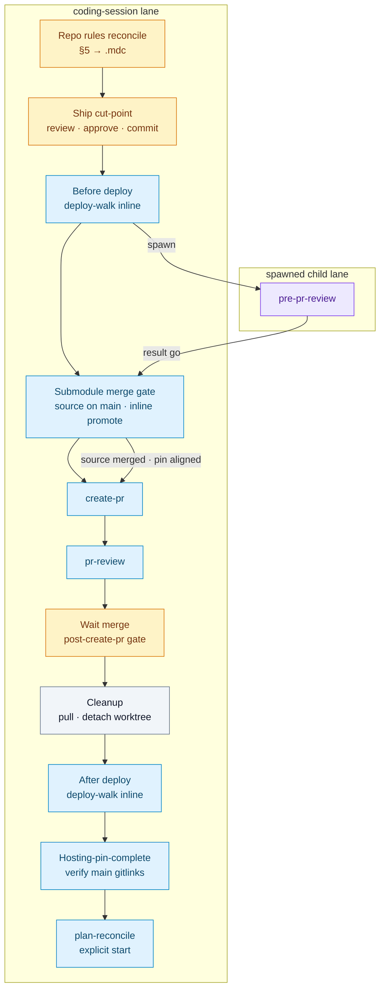

# Coding session — ship chain (on-demand)

**On-demand reference.** Load via step-bound `Read` from [`coding-session/SKILL.md`](../skills/coding-session/SKILL.md) at ship-chain gates — not in `laneRules` warm-up. Normative owner: slim `coding-session` skill; this doc holds cut-point through §8 re-emit procedure detail.

Cross-ref checkpoint UX: [`coding-session-checkpoint-ux.md`](coding-session-checkpoint-ux.md).

**Deploy-done emit guard:** Normative owner [`coding-session/SKILL.md`](../skills/coding-session/SKILL.md) § *Deploy-done emit guard* — after After deploy **`deployStatus: done`**, forbid success terminal without **`prShipComplete`**; auto-run post-after-deploy tail with zero modals on Checkpoint clean path. **Hosting-pin-complete:** when submodule gitlinks were in scope, run **`coding-session`** § *Hosting-pin-complete gate* before **`prShipComplete`**. Calibration: `incident_pr_ship_complete_tail_skipped_2026-08-02.agent-incident-report.md`; `incident_hosting_pin_promotion_treated_optional_2026-08-03.agent-incident-report.md`.

---

## Deploy test plan confirmations

When the developer **confirms** a numbered step in the anchored PR plan’s **`## N. Deploy test plan`** (§7 **`### Before deploy`** or **`### After deploy`**), treat chat as **not** the system of record — same contract as **`deploy-walk`**: state lives in the plan file. Prefer loading **`deploy-walk`** **inline** for checklist walks — it auto-runs agent-executable steps; use this ad-hoc path only for one-off confirmations when a full inline walk is not running.

**Before deploy + bootstrap:** Do **not** run inline **`deploy-walk`** (Before deploy) or flip **`### Before deploy`** checkboxes via this ad-hoc path until `outputs.bootstrapStatus: success`. **After deploy** confirmations may proceed when the PR is merged per normal rules.

**Classification gate (binding — ad-hoc path):** Before flipping any §7 checkbox on this path, **Read** the step text and classify per **`deploy-walk/SKILL.md`** § *Per-step and per-assertion classification* and § *Agent capability inventory (binding)*:

| Step kind | Ad-hoc behavior |
|-----------|-----------------|
| **Agent-executable only** | Run tools first; flip only after tool evidence. Developer chat does not substitute for file/YAML/diff checks. |
| **Mixed** (UI + file/YAML/diff) | Run agent-executable sub-assertions first; flip only when every sub-assertion is satisfied. |
| **Manual only** | Developer confirmation may authorize the flip; still patch the plan file in the same turn. When multiple manual steps remain, prefer inline **`deploy-walk`** (offers **`all-manual-steps-done`**) over ad-hoc one-at-a-time chat confirmations. |

**Forbidden on ad-hoc path:** flipping filesystem, `dispatch.yaml`, bundle JSON, sidecar, grep/diff, or YAML/JSON checks from developer confirmation alone when the inventory covers that work.

1. **Resolve `targetPlanPath`** — from spawn `inputs` (prefer verbatim absolute path under **`HOSTING_ROOT`**), `plan-state.mjs resolve --cwd "<worktreePath>"` with shell **`cwd`** at **`HOSTING_ROOT`**, or an explicit `@path` in the message. If multiple plans could apply, use **AskQuestion** once for **which plan** or **which step number** — not whether to persist.
2. **Classify then act** — apply the classification gate above. When agent-executable work applies, run it before any plan edit. Before patching, **Read** `targetPlanPath` and confirm it is the anchored PR plan under **`HOSTING_ROOT`** `.sedea/operations/` (matching spawn `inputs.targetPlanPath`); **forbidden:** paths under `WORKTREE_ROOT/.sedea/operations/`; if the path is missing, stale, or outside operations, stop without editing.
3. **Same-turn file edit** — before the reply ends, patch the matching §7 line only when classification + evidence rules pass. Append a dated note citing tool evidence or manual resolution.
4. **Reply** — state the **absolute `targetPlanPath`**, step numbers checked, and one-line evidence per flipped step.
5. **Do not** tell the developer “you can mark” or “likely done” without editing when you can write the operations plan. If you cannot write (permissions, wrong repo, missing path), say why and offer **`deploy-walk present 7`** / **`deploy-walk <N> done`** / **`deploy-walk all-manual-done`** or a concrete absolute path.
6. **Terminal `outputs`** — when you emit **`mission_control_send_agent_result`** in the same turn after edits, include `outputs.deployPlanStepsChecked` (array of step numbers, e.g. `[1,2,3]`) and `outputs.targetPlanPath`.

**Trigger examples:** “1 confirmed”, “step 2 done”, “3. confirmed” (numbered §7 items). Do not infer confirmation from vague chat (“looks good”) without an explicit step reference — use **AskQuestion** for the step number if needed. When the referenced step is agent-executable or mixed, treat the trigger as “run verification, then flip if pass” — not “developer said done, flip immediately.”

## Ship chain after implementation (coding-session lane)

Normative order on the **spawned implementation lane** — **do not** skip steps or jump to **`create-pr`** before **`pre-pr-review`**, and **do not** skip **Before deploy** after commit.



Pre-ship setup on this lane (not shown): implement → [Repo rules reconciliation](../skills/coding-session/SKILL.md#repo-rules-reconciliation-binding) → pre-review verification (step **8**) → [Ship cut-point gate](coding-session-ship-chain.md#ship-cut-point-gate-approve-commit-before-deploy). Center **`worktree-setup.sh`** runs before implement (bootstrap inside setup).

| Step | Section | Mode | Commit required? | Modal? |
|------|---------|------|------------------|--------|
| 0 | [Repo rules reconciliation](../skills/coding-session/SKILL.md#repo-rules-reconciliation-binding) | gate + procedure | **No** | **Yes** (plan-anchored; skip when §5 `_None_` only) |
| 1 | [Ship cut-point gate](coding-session-ship-chain.md#ship-cut-point-gate-approve-commit-before-deploy) | gate | **No** for review — combined modal covers approve + commit + Before deploy inline | **Yes** |
| 2 | [Before deploy deploy-walk handoff](coding-session-ship-chain.md#before-deploy-deploy-walk-handoff) | inline | **Yes** — after cut-point **Act** (commit when needed, then inline walk) | **No** (manual §7 step only) |
| 3 | [Auto-spawn pre-pr-review](coding-session-ship-chain.md#auto-spawn-pre-pr-review) + [Pre-PR review handoff](coding-session-ship-chain.md#pre-pr-review-handoff) | spawn | **Yes** — Before deploy resolved or skipped | **Spawn turn:** **No** modal — spawn alone (rule **4**); **next turn:** Yield / #external-wait resume modal |
| 3b | [Submodule merge gate (before create-pr)](#submodule-merge-gate-before-create-pr) | inline procedure | **No** — after **`pre-pr-review`** **go**; may amend hosting gitlink in **`WORKTREE_ROOT`** via script-backed **`promote-submodule-pin`** | **Checkpoint:** **No** on clean path — auto-advance source verify + inline promote; modal on source-not-on-main or promote hard stop |
| 4 | [Inline create-pr (auto on clean go)](#inline-create-pr-auto-on-clean-go) or [Create-PR handoff after go](#create-pr-handoff-after-go) | inline | After submodule gate passes (or N/A — no gitlink in scope) | **Checkpoint:** **No** — auto create-pr / **`approve-followups-create-pr`**; **non-Checkpoint:** modal when **`hasProposedFollowUps`** or **`proceed-create-pr`** |
| 5 | [Post-create-pr handoff gate](#post-create-pr-handoff-gate) | gate | **No** | **Yes** — **Checkpoint** and non-Checkpoint; **forbidden:** prose-only PR URL / *Next: inline pr-review* without modal |
| 6 | Inline **`pr-review`** (see skill path in **`plan.mdc`** §8) | inline | **No** — after PR exists | **Checkpoint:** **Yes** at disposition gate (PR review stop); **non-Checkpoint:** triage disposition modal |
| 7 | [Agent-delegated PR approve and merge](#agent-delegated-pr-approve-and-merge) | procedure | **No** — after clean **`pr-review`** or direct **`approve-merge-pr`** inspect when delegation authorized | **Checkpoint:** **No** when **`mergeDelegationReady`** — auto **`approve-merge-pr`**; modal on blockers only |
| 8 | [Post-merge workspace cleanup](#post-merge-workspace-cleanup) | procedure | **No** — after **`prState: merged`**, before After deploy | **No** — auto **`--apply`** when authorized; modal on failure/unclear ownership only; Checkpoint: [Post-merge Checkpoint chain](#post-merge-checkpoint-chain-binding) |
| 9 | [After deploy deploy-walk handoff](#after-deploy-deploy-walk-handoff) | inline | **No** — post-merge cleanup done or skipped | **Yes (Checkpoint)** — **`deploy-walk`** manual §7 steps only; **forbidden:** standalone coding-session After deploy recap modal |
| 9b | [Hosting-pin-complete gate](../skills/coding-session/SKILL.md#hosting-pin-complete-gate-before-prshipcomplete) | inline | **No** — when gitlink scope applies | **No** on clean path — auto-advance; modal when hosting PR merge pending |
| 10 | [Plan-reconcile handoff (inline)](#plan-reconcile-handoff-inline) | inline | **No** — auto from deploy-walk under Checkpoint when clean and hosting pins complete | **Yes** when reconcile inventory requires picks; Checkpoint auto-advance skips [Post–After deploy remainder authorization](#post-after-deploy-remainder-authorization) on clean path |

**Pre-PR review — spawn-only on this lane (binding).** [`pre-pr-review`](../pre-pr-review/SKILL.md) runs on a **fresh spawned child lane** only. **Auto-spawn** means emit **`mission_control_spawn_agent`** on a **spawn-only turn**, then **wait** for **`mission_control_send_agent_result`** on that child — **not** load the reviewer skill and execute its Steps 1–8 inline on the **`coding-session`** lane. Turn sequencing follows [`.sedea/centers/sedea/rules/4_mission.mdc`](.sedea/centers/sedea/rules/4_mission.mdc) § *Spawn-ack semantics (binding)* — cross-reference only; do **not** duplicate the full block here. Mirror ownership with [`create-pr`](../create-pr/SKILL.md) (inline-only there; spawn-only here).

**Forbidden on this lane:** `git commit` before ship cut-point approval; **`git commit`**, Before deploy **`deploy-walk`**, or ship cut-point while `outputs.bootstrapStatus` is `pending` or `failed`; run **`pre-pr-review`** **inline** on this lane; treat **auto-spawn** as self-execute review without a child lane; spawn **`pre-pr-review`** while the tree is dirty; run inline **`create-pr`** before steps 2–3 complete **or** before [Submodule merge gate (before create-pr)](#submodule-merge-gate-before-create-pr) passes when gitlink scope applies; treat ad-hoc Before-deploy checkbox edits as a substitute for step 2 inline **`deploy-walk`** when §7 has unchecked Before-deploy items; **three separate AskQuestions** for approve → commit → Before deploy when [Combined authorization](#combined-authorization) applies; prose-only ship cut-point handoff (*pick Ship cut-point*, *stay advisory*, *tell me when*) without **`mission_control_present_structured_choice`** call on that turn; [Create-PR handoff after go](#create-pr-handoff-after-go) or any modal with **`approve-followups-create-pr`** when **`hasProposedFollowUps`** is **false** after clean **`go`**; listing **`commit-push`**, push labels, or create-PR option ids in any modal while [Pre-PR ship gate (push/PR)](#pre-pr-ship-gate-pushpr) blocks them — except **`executive-override-push`** when the developer explicitly requests executive override in the **same** message; skipping submodule source merge verification or script-backed **`promote-submodule-pin`** when the committed diff touches a hosting-repo submodule gitlink under **`.sedea/centers/`**; treating **`promote-submodule-pin`** as N/A for built-in **`sedea`**.

## Pre-PR ship gate (push/PR)

**`prePrReviewCleared`** — **true** only when **`outputs.prePrReviewRecommendation === "go"`** from **`pre-pr-review`** on **this** ship chain.

Until **`prePrReviewCleared`**, **forbidden** in **any** modal on this lane (including ship cut-point, implementation continuation, and rule **2** default options):

| Forbidden | Includes |
|-----------|----------|
| Push options | **`commit-push`**, **`rebase-push-force-with-lease`** (before PR exists), labels containing *push* or *publish the worktree* |
| Create-PR options | **`proceed-create-pr`**, **`approve-followups-create-pr`**, **`create-pr-no-followups`**, **`create-pr-gate`** picks, labels containing *create PR* or *open PR* |
| Chat artifacts | GitHub `pull/new/` URLs, paraphrased “open a PR on GitHub” hints after local commit |

**Allowed before cleared:** **`commit-only`** paths at [Ship cut-point gate](coding-session-ship-chain.md#ship-cut-point-gate-approve-commit-before-deploy) (commit + Before deploy + auto **`pre-pr-review`** — push is **not** required for the committed diff review).

**After cleared:** push and inline **`create-pr`** run per [Inline create-pr (auto on clean go)](#inline-create-pr-auto-on-clean-go) and rule **20** § *Commit and push cadence* — **no** separate create-PR modal on clean **`go`** without proposed follow-ups.

### Executive override (push before cleared)

Include **`executive-override-push`** in a cut-point modal **only** when the developer's **same message** explicitly requests **executive override** for push before **`pre-pr-review`** (for example *executive override — push before pre-PR review*).

| Rule | Requirement |
|------|-------------|
| **Placement** | **Last** actionable option before **`more-details`** — never first or second |
| **Label** | *Executive override — approve, commit + push, run Before deploy walk* |
| **Act** | Same as legacy **`commit-push`** at cut-point — [Commit execution](coding-session-ship-chain.md#commit-execution-internal) may push on the response turn |
| **Default** | When override is **not** named in the message, **omit** **`executive-override-push`** and **`commit-push`** entirely |

## Implementation continuation gate

When **`outputs.shipPhase`** is **`implementing`** (or **`worktree`** after bootstrap) and **no** ship gate in § *Every developer-await turn* is open, close an implementation batch here — either auto-advance (Checkpoint clean path) or call **`mission_control_present_structured_choice`** (non-Checkpoint or exception path) using **`modalTitle`**: *Coding session — continue implementation*.

### Checkpoint — auto-advance `ready-for-review` (binding)

Under Checkpoint trust, **auto-advance** as if the developer picked **`ready-for-review`** — **no** **`mission_control_present_structured_choice`** — when **all** of the following hold after an implementation batch:

1. Step **5** scope for the current batch is complete (no in-progress edits or blocking tool failures).
2. **No open gotchas** — no unresolved caveats, blocking open items, or honest deferrals in plan **§8** that require developer pick before review.
3. **No unfixable failing tests** — prescribed pre-review verification (step **8** / Project rules) passes, or is honestly N/A for this PR.
4. **No material plan divergence** — work matches PR plan **§1 Single concern** and **§3 Change scope** (including substantive §§5–8 fill).

When clean: one-line recap (what landed, verification attestation), then proceed on the **same** or **next** turn as **`ready-for-review`** — run [Repo rules reconciliation (binding)](../skills/coding-session/SKILL.md#repo-rules-reconciliation-binding) when plan-anchored; open [Repo rules reconciliation gate](#repo-rules-reconciliation-gate) or [Ship cut-point gate](coding-session-ship-chain.md#ship-cut-point-gate-approve-commit-before-deploy) when steps **7–8** preconditions pass.

**Exception — gate required:** When **any** clean criterion fails, the agent cannot honestly attest, or the developer explicitly requests review deferral in the **same** message, call **`mission_control_present_structured_choice`** per below — not prose-only recap.

USER_CHECKPOINT — pick continue implementation or ready for review on this lane.

### Non-Checkpoint and exception modal (binding)

When Checkpoint auto-advance does **not** apply (non-Checkpoint dispatch, or any failed clean criterion above), close the turn with **`mission_control_present_structured_choice`**.

**Option order (binding):** When this gate is shown, **`ready-for-review`** MUST be the **first** actionable option — the recommended default path to [Ship cut-point gate](coding-session-ship-chain.md#ship-cut-point-gate-approve-commit-before-deploy). List **`continue-implement`** second.

**Required `options`** (in order):

| Option id | Label (brief) |
|-----------|---------------|
| `ready-for-review` | Ready for developer review — open ship cut-point |
| `continue-implement` | Continue implementation on this lane |
| `defer` | Defer — pause this lane |
| `more-details` | More details for option _ |

**Forbidden** on this gate: **`commit-push`**, push labels, any create-PR option ids, rule **2** *Commit + push* / *Open PR* defaults, or repurposing [Ship cut-point gate](coding-session-ship-chain.md#ship-cut-point-gate-approve-commit-before-deploy) options here.

| Pick | Actions |
|------|---------|
| **`continue-implement`** | Resume [Spawned implementation lane](../skills/coding-session/SKILL.md#spawned-implementation-lane) step 5 |
| **`ready-for-review`** | Run [Repo rules reconciliation (binding)](../skills/coding-session/SKILL.md#repo-rules-reconciliation-binding) when plan-anchored; then open [Repo rules reconciliation gate](#repo-rules-reconciliation-gate) or [Ship cut-point gate](coding-session-ship-chain.md#ship-cut-point-gate-approve-commit-before-deploy) on the **next** turn when step **8** pre-review verification passes |
| **`defer`** | Keep `continuationStatus: active`; no edits until developer continues |

- **`defaultOptionId: ready-for-review`** when implementation is substantially complete and only documented minor deferrals remain in §8 (developer may still pick **`continue-implement`**).

## Ship cut-point gate (approve, commit, Before deploy)

**Precondition:** `outputs.bootstrapStatus: success` (or bootstrap not required on this run). If bootstrap is `pending` or `failed`, finish or retry [Worktree bootstrap (mandatory)](../skills/coding-session/SKILL.md#worktree-bootstrap-mandatory) before opening this gate.

When implementation is **ready for developer review** (or the developer signals *ready for review* / *review my changes*), **stop** implementation edits and reach this gate — either auto-advance (Checkpoint clean path) or call **`mission_control_present_structured_choice`** (non-Checkpoint or exception path). This implements **20_efficient-pr-shipping.mdc** § *Review before commit* — **developer code review comes before any commit** — and combines what were separate approve, commit, and Before deploy inline modals into **one** structured choice when plan-anchored and §7 has work to walk.

### Checkpoint — auto-advance `commit-only` (binding)

Under Checkpoint trust, **auto-advance** as if the developer picked **`commit-only`** — **no** cut-point consent modal when clean — when **all** of the following hold:

1. [Implementation continuation gate](coding-session-ship-chain.md#implementation-continuation-gate) **clean** criteria pass (batch complete, no open gotchas, no unfixable failing tests, no material plan divergence).
2. Steps **7–8** preconditions pass — repo rules reconciliation complete or skipped; pre-review verification passes or is N/A.
3. `outputs.bootstrapStatus === 'success'` (or documented attested `--skip-*`).
4. Developer did **not** pick **`more-changes`**, **`defer`**, or name executive override in the **same** message.

**Full `commit-only` path (binding):** Checkpoint auto-advance **`commit-only`** always authorizes the **combined** cut-point pick — *Approve, commit, run Before deploy walk* — not the shortened approve-and-commit-only variant. On [Act after ship cut-point pick](#act-after-ship-cut-point-pick), run in order:

1. **`git commit`** when `git status --short` is non-empty.
2. Verify clean tree.
3. When plan-anchored, [Before deploy deploy-walk handoff](coding-session-ship-chain.md#before-deploy-deploy-walk-handoff) inline (`deployWalkScope: before-deploy-only`) — **even when** §7 **`### Before deploy`** items are already `[x]` (re-attest on the walk; do **not** skip because boxes were checked on a prior pass).
4. [Auto-spawn pre-pr-review](coding-session-ship-chain.md#auto-spawn-pre-pr-review) when Before deploy is satisfied (**same turn** when possible; otherwise [Yield gate](#yield-gate-checkpoint--binding) before StreamFinal).

**Forbidden on Checkpoint auto-advance:** resolving to **`commit-only-skip-before-deploy`**, the modal-only “approve and commit” shortcut that omits inline **`deploy-walk`**, or jumping to pre-PR spawn without inline Before deploy when plan-anchored; recording implicit **`commit-only`** then StreamFinal with “Act next turn” and **no** Yield / cut-point modal.

**Resolved pick id (exception paths only):**

| Tree state | Before deploy §7 | Auto-advance pick |
|------------|------------------|-------------------|
| Clean | Unchecked **`[ ]`** items remain | **`spawn-before-deploy-walk`** (tree already committed) |
| Clean | Free-form (no plan anchor) | **`commit-only`** — commit N/A · proceed to pre-PR when preconditions pass |

When clean criteria pass otherwise: one-line recap (diff summary, verification attestation, Before-deploy §7 state when plan-anchored), record implicit **`commit-only`**, then run [Act after ship cut-point pick](#act-after-ship-cut-point-pick) on the **same turn**. **If Act cannot continue this turn** → open [Yield gate](#yield-gate-checkpoint--binding) / Ship cut-point structured choice with **`continue-commit-only`** recommended — **never** prose-only StreamFinal.

**Exception — gate required:** When **any** clean criterion fails, the agent cannot honestly attest, or the developer requests **`more-changes`** / **`defer`** / executive override, call **`mission_control_present_structured_choice`** per below — not prose-only recap.

USER_CHECKPOINT — approve commit and Before deploy walk on this lane.

### Pre-send self-check (binding)

Before opening this gate, assert:

1. `outputs.bootstrapStatus === 'success'` **or** documented attested `--skip-*` in `outputs.bootstrapSkipFlags`. If `pending` or `failed`, do **not** open this gate — recover per [Worktree bootstrap (mandatory)](../skills/coding-session/SKILL.md#worktree-bootstrap-mandatory).

### Summarize and direct diff review

0. **Repo rules reconciliation** — When plan-anchored, complete step **7** of [Spawned implementation lane](../skills/coding-session/SKILL.md#spawned-implementation-lane) and pass [Repo rules reconciliation gate](#repo-rules-reconciliation-gate) (`outputs.repoRulesReconciliationStatus: complete` or `skipped-none`) before this gate.
1. **Pre-review verification** — Complete step **8** of [Spawned implementation lane](../skills/coding-session/SKILL.md#spawned-implementation-lane) (or the equivalent for this entry path). Re-run after each code-change batch before opening this gate. **Do not** open the review modal until prescribed hosting-repo verification passes.
2. Present a short summary: `git status --short` (call out **uncommitted** vs committed), files touched, and scope vs the anchored plan when present. If there are **no commits yet** in the worktree, say so — review is against the **working tree** and/or `git diff` / IDE SCM view. When plan-anchored, include **`outputs.reconciledRepoRulesPaths`** (or *none — §5 `_None_`*) in the recap.
3. When plan-anchored, **read** §7 **`### Before deploy`** and note in the recap: empty / all `[x]` / *N* unchecked Before-deploy steps (list step numbers when ≤5).
4. Tell the developer to review in the **IDE diff** (SCM: working tree, staged, and unstaged) and/or `git diff` / `git diff --cached` as appropriate. Do **not** treat “implementation done” chat as diff review.
5. **Do not** run `git commit`, `git push`, inline **`deploy-walk`**, spawn **`pre-pr-review`**, or inline **`create-pr`** in the same assistant turn as this gate's modal.

### Orientation vs ship cut-point (binding)

Per **`.sedea/centers/sedea/rules/5_alignment-safeguard.mdc`** § *Pre-assessment*, *What's next?* / *what now?* are orientational **only** when the lane is **not** blocked on a ship gate.

When **any** applies, the turn is **not** orientation-only — open [Ship cut-point gate](coding-session-ship-chain.md#ship-cut-point-gate-approve-commit-before-deploy) **in the same assistant message** (MCP structured choice, not prose recap alone):

- Implementation is **ready for developer review** (or the developer signals *ready for review* / *review my changes*).
- The transcript shows implementation edits finished and the ship chain has **not** yet received a cut-point modal selection.
- The developer asks *what's next?*, *what now?*, or similar while the above holds.

Answer orientation **inside** **`displayMarkdown`** and ship **`askQuestion`** together — do **not** defer the modal to a later turn.

### Combined authorization

When Checkpoint auto-advance does **not** apply (non-Checkpoint dispatch, or any failed clean criterion above), use **one** **AskQuestion** or **`mission_control_present_structured_choice`** (`modalTitle`: *Coding session — approve, commit, Before deploy*) — recap + modal in one message per rule **2**. **Do not** chain separate modals for approve, then commit, then Before deploy when this subsection applies.

**When to use the combined modal (normative):** plan-anchored run **and** §7 **`### Before deploy`** has at least one **`[ ]`** item (not empty, not only *None — …*, not all `[x]`).

| Option id | Label (brief) | Authorizes on **next** turn ([Act after pick](#act-after-ship-cut-point-pick)) |
|-----------|---------------|--------------------------------------------------------------------------------|
| `commit-only` | Approve, commit, run Before deploy walk | Implementation approved · **`git commit`** when tree dirty · inline **`deploy-walk`** (`before-deploy-only`) · **no** **`git push`** until [Pre-PR ship gate (push/PR)](#pre-pr-ship-gate-pushpr) clears |
| `commit-only-skip-before-deploy` | Approve, commit, skip Before deploy | Implementation approved · **`git commit`** when dirty · documented skip (note under §7 or **`## Follow-ups`**) · **no** deploy-walk |
| `more-changes` | More implementation changes first | Return to [Spawned implementation lane](../skills/coding-session/SKILL.md#spawned-implementation-lane) step 5 |
| `defer` | Defer ship chain | Keep `continuationStatus: active`; no commit, no inline walk |
| `more-details` | More details for option _ | Elaborate; re-ask combined modal |
| `executive-override-push` | Executive override — approve, commit + push, run Before deploy walk | **Only** when developer named executive override in the **same** message — **last** before **`more-details`** |

Option id **`commit-only`** satisfies rule **6** git layer **on the pick turn** — run commit on the **developer's response turn** only, not in the same assistant turn as the modal. **`executive-override-push`** alone authorizes **`git push`** at cut-point before **`prePrReviewCleared`**.

**Forbidden in default cut-point modals:** **`commit-push`** and any push/create-PR labels unless **`executive-override-push`** is explicitly included per [Pre-PR ship gate (push/PR)](#pre-pr-ship-gate-pushpr).

**When Before deploy is already satisfied** (empty, *None*, or all `[x]`) but the tree is dirty, use **one** modal (`modalTitle`: *Coding session — approve and commit*) with **`commit-only`** / **`more-changes`** / **`defer`** / **`more-details`** (plus **`executive-override-push`** only when override named) — then [Auto-spawn pre-pr-review](coding-session-ship-chain.md#auto-spawn-pre-pr-review) on the **next** turn when preconditions pass, not inline deploy-walk.

**When the tree is clean** and Before-deploy items remain, use **one** modal with:

| Option id | Label (brief) |
|-----------|---------------|
| `spawn-before-deploy-walk` | Approve, run Before deploy walk (already committed) |
| `skip-before-deploy` | Skip Before deploy (executive override) |
| `more-changes` | More implementation changes first |
| `defer` | Defer ship chain |
| `more-details` | More details for option _ |

**Free-form** (no plan anchor): combined approve + commit modal only — **`commit-only`** / **`more-changes`** / **`defer`** / **`more-details`** (plus **`executive-override-push`** only when override named) — then [Auto-spawn pre-pr-review](coding-session-ship-chain.md#auto-spawn-pre-pr-review) on the **next** turn when preconditions pass.

Do **not** use option labels that say *run pre-pr-review*, *push*, or *create PR* here — push and PR wait for [Pre-PR ship gate (push/PR)](#pre-pr-ship-gate-pushpr); **`pre-pr-review`** auto-advances after cut-point **Act** and Before deploy (see [Auto-spawn pre-pr-review](coding-session-ship-chain.md#auto-spawn-pre-pr-review)).

### Spawned lane — ship cut-point MCP structured choice (binding)

**In order to use the AskQuestion modal**, call **`mission_control_present_structured_choice`** (recap in `displayMarkdown`, options in `askQuestion`) — same option ids as the combined modal. Example shape (replace `<recap>` with diff summary + Before-deploy count):

```json
{
  "displayMarkdown": "<recap>",
  "askQuestion": {
    "modalTitle": "Coding session — approve, commit, Before deploy",
    "questions": [
      {
        "id": "ship-cut-point",
        "prompt": "Approve implementation, commit if needed, and start Before deploy walk?",
        "allowMultiple": false,
        "options": [
          {
            "id": "commit-only",
            "label": "Approve, commit, run Before deploy walk"
          },
          {
            "id": "commit-only-skip-before-deploy",
            "label": "Approve, commit, skip Before deploy"
          },
          {
            "id": "more-changes",
            "label": "More implementation changes first"
          },
          {
            "id": "defer",
            "label": "Defer ship chain"
          },
          {
            "id": "more-details",
            "label": "More details for option _"
          }
        ]
      }
    ]
  }
}
```

Omit **`commit-only-skip-before-deploy`** when Before deploy is already satisfied; omit commit options when the tree is clean and use `spawn-before-deploy-walk` instead.

### Pre-send self-check (ship cut-point)

Before ending a turn that opens [Ship cut-point gate](coding-session-ship-chain.md#ship-cut-point-gate-approve-commit-before-deploy):

1. **`mission_control_present_structured_choice`** is called with recap in **`displayMarkdown`** and valid **`askQuestion`** (spawned lane — MCP structured choice).
2. MCP args include **`displayMarkdown`**, **`askQuestion.questions`** with ≥1 option (`id` + `label`) matching [Combined authorization](#combined-authorization) for this tree state.
3. Recap includes [Session orientation table (binding)](#session-orientation-table-binding) as the first block, then `git status --short` summary and Before-deploy §7 state when plan-anchored.
4. **`commit-push`** and create-PR option ids are **absent** unless [Pre-PR ship gate (push/PR)](#pre-pr-ship-gate-pushpr) allows **`executive-override-push`** on this message.
5. Message contains **no** prose-only *advisory* / *pick in chat* / *I'll wait* closing — if any check fails, fix before send.

### Act after ship cut-point pick

Run on the **developer's response turn** after a cut-point pick — **not** in the same assistant turn as the modal.

| Pick | Actions (in order) |
|------|---------------------|
| **`commit-only`** (Before deploy unchecked) | 1. **`git commit`** if `git status --short` is non-empty · 2. Verify clean tree · 3. [Before deploy deploy-walk handoff](coding-session-ship-chain.md#before-deploy-deploy-walk-handoff) inline (no second modal) · 4. [Auto-spawn pre-pr-review](coding-session-ship-chain.md#auto-spawn-pre-pr-review) when Before deploy satisfied (same or next turn) |
| **`executive-override-push`** (Before deploy unchecked) | Same as **`commit-only`** row, then **`git push`** on the response turn when commit succeeded — override only |
| **`commit-only-skip-before-deploy`** | 1. **`git commit`** if dirty · 2. Append dated skip note under §7 or **`## Follow-ups`** · 3. [Auto-spawn pre-pr-review](coding-session-ship-chain.md#auto-spawn-pre-pr-review) |
| **`commit-only`** (Before deploy satisfied or free-form) | 1. **`git commit`** if dirty · 2. Verify clean · 3. [Auto-spawn pre-pr-review](coding-session-ship-chain.md#auto-spawn-pre-pr-review) |
| **`commit-only`** (Checkpoint auto-advance, plan-anchored) | Same as **`commit-only`** (Before deploy unchecked) row — **always** run inline Before deploy **`deploy-walk`** before pre-PR spawn, even when §7 boxes are already `[x]` |
| **`executive-override-push`** (Before deploy satisfied or free-form) | Same as **`commit-only`** row, then **`git push`** when commit succeeded |
| **`spawn-before-deploy-walk`** | [Before deploy deploy-walk handoff](coding-session-ship-chain.md#before-deploy-deploy-walk-handoff) inline |
| **`skip-before-deploy`** | Dated skip note · [Auto-spawn pre-pr-review](coding-session-ship-chain.md#auto-spawn-pre-pr-review) |

- **`defaultOptionId: commit-only`** when implementation is clean and the tree is dirty (developer may still pick **`more-changes`** or **`defer`**).

If commit fails or tree stays dirty after commit, stop with `partial` — do not run inline **`deploy-walk`** or spawn **`pre-pr-review`**.

**Same user message** may authorize the combined path in prose (*approve, commit, and run Before deploy*) — treat as **`commit-only`** when Before deploy applies, per rule **20**.

## Commit execution (internal)

**Not a separate AskQuestion gate.** Runs only inside [Act after ship cut-point pick](#act-after-ship-cut-point-pick) when the pick id is **`commit-only`** or **`executive-override-push`**.

1. Skip **`git commit`** when `git status --short` is empty.
2. Use the commit message style from recent worktree history and plan scope.
3. **`executive-override-push`** also runs **`git push`** after a successful commit on the **same response turn** — the **only** cut-point path that pushes before **`prePrReviewCleared`**. Routine push before **`create-pr`** runs after **`pre-pr-review`** **`go`** per [Inline create-pr (auto on clean go)](#inline-create-pr-auto-on-clean-go) and rule **20** § *Commit and push cadence*.
4. Verify `git status --short` is empty before inline deploy-walk or pre-PR authorization.

## Before deploy deploy-walk handoff

**Precondition:** `outputs.bootstrapStatus: success`. **Do not** run Before deploy **`deploy-walk`** inline while bootstrap is `pending` or `failed`.

Run from [Act after ship cut-point pick](#act-after-ship-cut-point-pick) when the cut-point pick authorizes inline walk (**`commit-only`**, **`executive-override-push`**, or **`spawn-before-deploy-walk`**) — **no second AskQuestion** for the walk on that path. **Do not** spawn **`pre-pr-review`** or run inline **`create-pr`** until this step completes or is skipped via **`commit-only-skip-before-deploy`** / **`skip-before-deploy`**.

When `targetPlanPath` resolves to a PR plan:

1. **Read** §7 **`### Before deploy`**. If empty, only *None — …*, or every item is `[x]`, note in one line and continue to [Auto-spawn pre-pr-review](coding-session-ship-chain.md#auto-spawn-pre-pr-review).
2. When any **`[ ]`** Before-deploy items remain, load `.sedea/centers/software-development/missions/plan-and-deliver/skills/deploy-walk/SKILL.md` and run it **inline on this lane** — **do not** emit **`mission_control_spawn_agent`** for **`deploy-walk`**.

**Inline context:**

| Inline context field | Value |
|----------------------|--------|
| `targetPlanPath` / `targetPlanSlug` | From coding-session state when plan-anchored |
| `worktreePath`, `worktreeName` | From worktree / git |
| `deployWalkScope` | `"before-deploy-only"` — walk only **`### Before deploy`** while `**Status:**` stays `drafted` |
| `ledgerParent` | From coding-session ledger when present |
| `upstreamSkill` | `"coding-session"` |

3. Follow **`deploy-walk`** procedure (including autonomous agent-executable pass for Before deploy). Merge **`## Completion (inline)`** into coding-session `outputs` (`beforeDeployStatus`, `deployStatus`, `shipPhase`, `rowStatus`, `remainingTasks`, …).
   - **Binding — agent capability inventory:** Apply **`deploy-walk/SKILL.md`** § *Agent capability inventory (binding)*. Run the [Autonomous agent-executable pass](../deploy-walk/SKILL.md#autonomous-agent-executable-pass) without asking the developer to run terminal commands, grep logs, parse files, or search for phrases when the inventory covers the step.
   - **Forbidden:** prose or modal handoff such as “run this command”, “grep the log for …”, “open the file and find …”, or “parse the output” for agent-executable Before-deploy steps.
   - **Manual steps only:** present full **Testing steps** per **`deploy-walk`** § *Step 4 — Step presentation contract* — not a one-line “please verify.” Close each manual gate with **`deploy-walk`** [Manual step await gate](../deploy-walk/SKILL.md#manual-step-await-gate-binding) — step-by-step (**`deploy-step-n-done`**, **`present-next-manual-step`**) **and** batch **`all-manual-steps-done`** when the developer verified all remaining manual steps in one take.
4. When inline **`deploy-walk`** sets **`outputs.returnToImplementation: true`**, stop the ship chain and run [Return to implementation from deploy walk (new worktree)](#return-to-implementation-from-deploy-walk-new-worktree) on the **next** turn — do **not** spawn **`pre-pr-review`** until the new worktree is bootstrapped and implementation resumes.
5. When `beforeDeployStatus` is `complete`, all Before-deploy boxes are `[x]` or explicitly skipped, continue to [Auto-spawn pre-pr-review](coding-session-ship-chain.md#auto-spawn-pre-pr-review) on the **next** turn (or same turn when the walk finishes without a pending manual step). If a **manual** step awaits developer input, keep `continuationStatus: "active"` on this lane and close with **AskQuestion** or **`mission_control_present_structured_choice`** per **`deploy-walk`** [Manual step await gate](../deploy-walk/SKILL.md#manual-step-await-gate-binding) — step-by-step or **`all-manual-steps-done`** — do not prose-only “resume via next message”; do not spawn **`pre-pr-review`** until Before deploy is satisfied or documented skip.
6. Do **not** wait for a child **`mission_control_send_agent_result`** — there is no **`deploy-walk`** child lane.

**Legacy / exceptional second modal:** use a separate **AskQuestion** for inline walk **only** when the developer returns mid-chain without a prior cut-point pick (for example after *more-changes* and a new review pass) and Before-deploy items remain — same options as [Combined authorization](#combined-authorization) Before-deploy rows (`spawn-before-deploy-walk`, `skip-before-deploy`, …). **Do not** use this when the combined cut-point modal already ran in the same review pass.

## Auto-spawn pre-pr-review

Run **after** commit + [Before deploy deploy-walk handoff](coding-session-ship-chain.md#before-deploy-deploy-walk-handoff) (or documented skip). **No authorization modal** — developer approval at [Ship cut-point gate](coding-session-ship-chain.md#ship-cut-point-gate-approve-commit-before-deploy) (approve + commit + Before deploy) is sufficient to spawn **`pre-pr-review`**.

**Spawn-only (binding).** **`pre-pr-review`** is **forbidden inline** on this lane — see **Pre-PR review — spawn-only on this lane (binding)** above. **Auto-spawn** = on the **spawn turn**, emit **`mission_control_spawn_agent` alone** per [Pre-PR review handoff](coding-session-ship-chain.md#pre-pr-review-handoff) and [`.sedea/centers/sedea/rules/4_mission.mdc`](.sedea/centers/sedea/rules/4_mission.mdc) § *Spawn-ack semantics (binding)* — **forbidden** to batch spawn with **`mission_control_present_structured_choice`**, **AskQuestion**, or external-wait prose on that turn. On the **next** turn, open the Yield / #external-wait resume modal per [Yield gate](#yield-gate-checkpoint--binding), then **wait** for the child **`mission_control_send_agent_result`**. **Forbidden:** loading [`pre-pr-review/SKILL.md`](../pre-pr-review/SKILL.md) and running review steps here instead of spawning; narrating *Spawned pre-PR reviewer* / *Child is running* from **`transcriptOnly`** MCP ack alone.

**Auto-advance:** When [Pre-PR review handoff preconditions](#review-handoff-preconditions) all pass, proceed directly to [Pre-PR review handoff](coding-session-ship-chain.md#pre-pr-review-handoff) on the **next** turn — one-line recap in prose or prior turn output, then emit spawn. Do **not** open a separate *Coding session — pre-PR review* modal.

**Defer / more changes:** When the developer says *more changes*, *defer review*, or equivalent **before** spawn runs, stop auto-advance and route to [Spawned implementation lane](../skills/coding-session/SKILL.md#spawned-implementation-lane) or keep `continuationStatus: active` with structured choice per rule **2** § *Default continuation options*.

**Forbidden:** treating ship cut-point approval as insufficient for spawn; opening the legacy pre-PR authorization modal when preconditions pass.

### Legacy pre-PR authorization modal (removed)

The former **Pre-PR review authorization** gate (`proceed-pre-pr-review`) is **obsolete**. Do not open its gate modal or options unless mission completeness triage directs a temporary workaround.

## Pre-PR review handoff

This skill spawns **`pre-pr-review`** only **after** [Ship chain after implementation](coding-session-ship-chain.md#ship-chain-after-implementation-coding-session-lane) cut-point **Act**, [Before deploy deploy-walk handoff](coding-session-ship-chain.md#before-deploy-deploy-walk-handoff) (or skip), and [Auto-spawn pre-pr-review](coding-session-ship-chain.md#auto-spawn-pre-pr-review) preconditions pass — **without** a separate authorization modal.

### Review handoff preconditions

Before spawning **`pre-pr-review`**:

1. [Ship cut-point gate](coding-session-ship-chain.md#ship-cut-point-gate-approve-commit-before-deploy) completed — developer approved implementation via combined modal or equivalent; [Commit execution](coding-session-ship-chain.md#commit-execution-internal) completed when the tree was dirty — at least one commit in the worktree when there were changes to land.
2. [Before deploy deploy-walk handoff](coding-session-ship-chain.md#before-deploy-deploy-walk-handoff) completed or skipped — **do not** spawn **`pre-pr-review`** while unchecked Before-deploy items remain without inline walk/skip documentation.
3. `git status --short` in the worktree is empty. Uncommitted edits are invisible to the committed review diff, so do not spawn the reviewer while dirty.
4. `git log --oneline <baseRef>..HEAD` shows at least one commit.
5. `git diff <baseRef>...HEAD` is non-empty.
6. For plan-anchored runs, `plan-state.mjs resolve --cwd "<worktreePath>"` or supplied inputs identify the PR plan.

If any precondition fails, stop with `partial`, keep `continuationStatus: "active"`, and report the missing ship-chain step. Do not silently commit, push, skip Before deploy, or spawn review.

### Review handoff inputs

Compile the **`pre-pr-review`** child inputs:

- `anchorType`: `plan` when a PR plan path is known, otherwise `free-form`.
- `targetPlanPath` / `targetPlanSlug`: required for `plan`.
- `worktreePath`
- `worktreeName`
- `baseRef`
- `projectRules`: absolute worktree `.cursor/rules/*.mdc` paths curated the same way as the implementation prompt — include **`outputs.reconciledRepoRulesPaths`** from [Repo rules reconciliation (binding)](../skills/coding-session/SKILL.md#repo-rules-reconciliation-binding) when populated.
- `diffSummary`: **object** (`type: object` per `pre-pr-review` frontmatter) — **not** a prose string. Mission Control spawn validation rejects strings (`invalid-inputs`). Minimal shape (populate from the committed diff):

  ```json
  {
    "commitCount": 1,
    "fileCount": 5,
    "insertions": 116,
    "deletions": 15,
    "head": "0b0419e8f5b",
    "subject": "optional short subject",
    "files": ["path/a.ts", "path/b.md"]
  }
  ```

  **Forbidden:** a single human-readable summary string as `diffSummary`.
- `ledgerParent`
- `upstreamSkill: "coding-session"`

### Pre-PR spawn turn sequencing (binding)

Per [`.sedea/centers/sedea/rules/4_mission.mdc`](.sedea/centers/sedea/rules/4_mission.mdc) § *Spawn-ack semantics (binding)* — reference only:

| Turn | Obligation |
|------|------------|
| **Spawn turn** | Call **`mission_control_spawn_agent`** for `.sedea/centers/software-development/missions/plan-and-deliver/skills/pre-pr-review/SKILL.md` with compiled inputs — **alone**. Optional one-line ack: *Pre-PR spawn request recorded — host mirror pending* — **forbidden:** *Spawned pre-PR reviewer*, *Child is running*, or *Waiting for child result* before host-visible child confirmation. **Forbidden:** **`mission_control_present_structured_choice`** or **AskQuestion** on this turn. |
| **Next turn** | Open **`mission_control_present_structured_choice`** (next-step resume: continue when child returns / check status / pause / More details) per [Yield gate](#yield-gate-checkpoint--binding) and [`.sedea/centers/sedea/rules/2_ask-question-instructions.mdc`](.sedea/centers/sedea/rules/2_ask-question-instructions.mdc) § **External-wait / next-step modal**. **Forbidden:** prose-only *waiting for child* StreamFinal. |

Do not open a PR before the reviewer returns `recommendation: "go"`.

### Review result aggregation

When Mission Control delivers the **`pre-pr-review`** result:

1. Copy `blockers`, `flags`, `proposedFollowUps`, `followUpsAppended`, `codingAgentHandback`, `requiresDeveloperApproval`, `remainingTasks`, `activeLanes`, and `openLedgerEntries` into the coding-session result. Record `outputs.prePrReviewRecommendation` from the child. When recommendation is **`go`**, **`prePrReviewCleared`** is **true** for [Pre-PR ship gate (push/PR)](#pre-pr-ship-gate-pushpr); otherwise **false**.
2. Compute **`hasProposedFollowUps`** — **true** when **`outputs.proposedFollowUps`** from the child is a non-empty array with at least one non-whitespace string entry; **false** when the field is missing, null, not an array, or `[]`. Do **not** treat whitespace-only strings as follow-ups.
3. Compute **`actionablePrePrFindings`** — **true** when **any** of:
 - `recommendation` is `no-go`
 - `blockers` is non-empty
 - `flags` is non-empty
 - `codingAgentHandback` includes a non-empty **Must** or **Should** group (ignore **Defer**-only handback and items tagged **`[G §7 After deploy — post-merge]`**)
4. When **`actionablePrePrFindings`** is true, **immediately recommend** addressing pre-PR review findings before PR creation or another review pass — include one explicit sentence in the recap (for example: *Pre-PR review found issues; fix the relevant items on this lane before opening a PR.*). Do not deliver a findings-only recap without that recommendation.
5. **If `actionablePrePrFindings`** — under Checkpoint trust **auto-advance** **`fix-now-session`** on the **same turn** as the child result (one-line recap + **Act** implement Must + Should; when **`hasProposedFollowUps`**, also append those bullets to the PR plan **`## Follow-ups`** before edits) — **no** [Review feedback approval gate](#review-feedback-approval-gate) modal. Otherwise (non-Checkpoint or exception) open that gate on **this lane** **before** [Inline create-pr (auto on clean go)](#inline-create-pr-auto-on-clean-go) or [Create-PR handoff after go](#create-pr-handoff-after-go). Do **not** jump to inline **`create-pr`** while actionable findings remain unfixed. **Forbidden under Checkpoint clean path:** findings-only recap + turn-end modal; prose *pick how to handle findings*; deferring Act to a later turn when criteria in [Checkpoint — auto-advance `fix-now-session`](#checkpoint--auto-advance-fix-now-session-binding) pass.
6. **If NOT `actionablePrePrFindings`** and `recommendation` is `go` **and NOT `hasProposedFollowUps`** — on the **same turn** as the reviewer result when push/create-pr can start immediately, or the **next** turn when a prior step still owns StreamFinal: one informational transcript line only (for example: *Pre-PR review go; no follow-ups — running submodule merge gate.*). Proceed to [Submodule merge gate (before create-pr)](#submodule-merge-gate-before-create-pr), then [Inline create-pr (auto on clean go)](#inline-create-pr-auto-on-clean-go) **without** a Create-PR or follow-up approval modal. Do not make **`pre-pr-review`** run inline **`create-pr`** inside the child-result delivery itself. **Forbidden:** [Create-PR handoff after go](#create-pr-handoff-after-go); any modal listing **`approve-followups-create-pr`** or **`create-pr-no-followups`**; pausing for developer PR approval when `proposedFollowUps` is empty; jumping to **`create-pr`** while the submodule gate is open or failed.
7. **If NOT `actionablePrePrFindings`** and `recommendation` is `go` **and `hasProposedFollowUps`** — under Checkpoint trust **auto-advance** **`approve-followups-create-pr`** on the **same turn** (append follow-ups to the PR plan **`## Follow-ups`**, then [Submodule merge gate (before create-pr)](#submodule-merge-gate-before-create-pr), then inline **`create-pr`** with **`followUpsAppended: true`**) — **no** Create-PR modal. Otherwise open [Create-PR handoff after go](#create-pr-handoff-after-go). Do **not** make **`pre-pr-review`** run inline **`create-pr`** inside the child-result delivery itself.
8. If review failed, was aborted, or was abandoned, keep the ledger entry blocked until the developer retries, defers, or abandons the review.

### Review feedback approval gate

When **`actionablePrePrFindings`** is true (see [Review result aggregation](#review-result-aggregation)) — including **`recommendation: "go"`** with **`flags`** or **Must** / **Should** handback:

### Checkpoint — auto-advance `fix-now-session` (binding)

Under Checkpoint trust, **auto-advance** as if the developer picked **`fix-now-session`** (implement Must + Should on this lane) — **no** **`mission_control_present_structured_choice`** and **no** `USER_CHECKPOINT` on this happy path — when **all** hold:

1. **`actionablePrePrFindings`** is true and findings are actionable on this worktree (paths exist; scope matches PR §1).
2. Developer did **not** name **`defer`**, **`revise-scope`**, or **`proceed-create-pr`** in the **same** message.
3. Agent can honestly apply Must (and Should when present) without inventing product requirements.

When clean: one-line recap of findings + *Checkpoint — implementing pre-PR findings* + **Act on this same turn** per [Act after review feedback pick](#act-after-review-feedback-pick) for **`fix-now-session`** (implement Must + Should; append any **`proposedFollowUps`** to the PR plan **`## Follow-ups`** with a dated *(pre-PR follow-up)* note). **Forbidden:** opening the Non-Checkpoint modal below; ending StreamFinal with findings-only prose while waiting for a developer pick; treating the leftover `USER_CHECKPOINT` under Non-Checkpoint as applying to this clean path.

**Exception — gate required:** When any clean criterion fails, findings are ambiguous, or the developer requests defer/revise/skip-fixes, call **`mission_control_present_structured_choice`** per below.

### Non-Checkpoint and exception modal (binding)

USER_CHECKPOINT — pick how to proceed with pre-PR review findings. defaultOptionId: fix-now-session

When Checkpoint auto-advance does **not** apply (non-Checkpoint dispatch, or any failed clean criterion above):

1. Present the review summary to the developer: `recommendation`, blockers, `Must`, `Should`, `flags`, and any proposed follow-ups for the PR plan. **Do not** surface **`Defer`** or post-merge **`### After deploy`** items — **`pre-pr-review`** omits them; drop any legacy **`[G §7 After deploy — post-merge]`** bullets if present in child outputs. **Recommend** fixing relevant findings before PR creation or re-review (same wording as [Review result aggregation](#review-result-aggregation) step 3).
2. Use **one** **AskQuestion** or **`mission_control_present_structured_choice`** before making any code or plan edits (`modalTitle`: *Pre-PR review — address findings*) — **Checkpoint:** skip this modal when auto-advance above applies. Required options **in this order** (omit rows marked *go-only* when `recommendation` is `no-go`):

| Option id | Label (brief) | Agent action |
|-----------|---------------|--------------|
| `fix-now-session` | Implement pre-PR review findings now (this session) | Continue on **this coding-session lane** in the attached worktree; implement reviewer `Must` + `Should` items; append any **`proposedFollowUps`** to **`## Follow-ups`**; keep `continuationStatus: "active"` |
| `apply-must` | Apply Must fixes only | Edit only blocker / `Must` items on this lane |
| `apply-must-should` | Apply Must + Should fixes | Edit blocker / `Must` and `Should` items on this lane |
| `proceed-create-pr` | Proceed to create PR (skip fixes for now) | *go-only* — on **next** turn, [Submodule merge gate (before create-pr)](#submodule-merge-gate-before-create-pr) then [Inline create-pr (auto on clean go)](#inline-create-pr-auto-on-clean-go); no code edits this pick |
| `revise-scope` | Revise review scope | Clarify or challenge findings before code edits |
| `defer` | Defer / abandon review fixes | Keep ledger blocked or mark the PR plan deferred/abandoned per developer choice |
| `more-details` | More details for option _ | Elaborate; ask again |

3. Do not interpret the reviewer handback itself as approval. No source edits, plan edits, commits, pushes, PR creation, or new review spawn occur until the developer chooses an approval option (except **`proceed-create-pr`**, which only authorizes the Create-PR gate on the **next** turn) — **except** Checkpoint auto-advance above, which **is** approval.
4. **`fix-now-session`**, **`apply-must`**, and **`apply-must-should`** authorize implementation on **this lane** only — not a detached session prompt or a new Mission Control dispatch for coding.
5. After approved fixes are implemented, run [Spawned implementation lane](../skills/coding-session/SKILL.md#spawned-implementation-lane) step **7** (pre-review verification) when applicable, then restart from [Ship cut-point gate](coding-session-ship-chain.md#ship-cut-point-gate-approve-commit-before-deploy) (combined approve + commit + Before deploy when applicable, then **`pre-pr-review`**). The loop repeats until **`pre-pr-review`** returns `go` with no **`actionablePrePrFindings`**, or the developer chooses **`proceed-create-pr`** or **`defer`**.
6. Track each loop pass in outputs as `reviewLoopCount` and keep `continuationStatus: "active"` while approval, fixes, implementation review, commit, Before deploy, re-review, or pending Create-PR after **`proceed-create-pr`** remains open.

### Spawned lane — review feedback MCP structured choice (binding)

**Checkpoint clean path:** skip this entire subsection — [Checkpoint — auto-advance `fix-now-session`](#checkpoint--auto-advance-fix-now-session-binding) owns Act with **no** modal.

**In order to use the AskQuestion modal** after **`pre-pr-review`** returns with **`actionablePrePrFindings`** on **non-Checkpoint** or exception paths only, call **`mission_control_present_structured_choice`** — recap in `displayMarkdown`, options in `askQuestion` (see [Spawned lane — MCP structured choice (binding)](#spawned-lane--mcp-structured-choice-binding)). Example (replace `<recap>`; omit `proceed-create-pr` when `recommendation` is `no-go`):

```json
{
  "displayMarkdown": "<recap>",
  "askQuestion": {
    "modalTitle": "Pre-PR review — address findings",
    "questions": [
      {
        "id": "pre-pr-feedback",
        "prompt": "How should we handle pre-PR review findings?",
        "allowMultiple": false,
        "options": [
          {
            "id": "fix-now-session",
            "label": "Implement pre-PR review findings now (this session)"
          },
          {
            "id": "apply-must",
            "label": "Apply Must fixes only"
          },
          {
            "id": "apply-must-should",
            "label": "Apply Must + Should fixes"
          },
          {
            "id": "proceed-create-pr",
            "label": "Proceed to create PR (skip fixes for now)"
          },
          {
            "id": "revise-scope",
            "label": "Revise review scope"
          },
          {
            "id": "defer",
            "label": "Defer / abandon review fixes"
          },
          {
            "id": "more-details",
            "label": "More details for option _"
          }
        ]
      }
    ]
  }
}
```

### Act after review feedback pick

Run on the **developer's response turn** after a feedback modal — **or** on the **same turn** as the **`pre-pr-review`** child result when Checkpoint auto-advance **`fix-now-session`** applies (no modal).

| Pick | Actions |
|------|---------|
| **`fix-now-session`**, **`apply-must`**, **`apply-must-should`** | Implement approved scope on this lane (Checkpoint **`fix-now-session`** = Must + Should); when **`hasProposedFollowUps`**, append each to plan **`## Follow-ups`** first; then [Ship cut-point gate](coding-session-ship-chain.md#ship-cut-point-gate-approve-commit-before-deploy) when fixes are ready |
| **`proceed-create-pr`** | Run [Submodule merge gate (before create-pr)](#submodule-merge-gate-before-create-pr) then [Inline create-pr (auto on clean go)](#inline-create-pr-auto-on-clean-go) on **next** turn when **`hasProposedFollowUps`** is **false**; otherwise [Create-PR handoff after go](#create-pr-handoff-after-go) (requires prior `recommendation: "go"`) |
| **`revise-scope`**, **`more-details`** | Clarify; re-open feedback gate |
| **`defer`** | Stop ship chain per developer choice |

### User requests to open a PR (before inline `create-pr`)

When the developer says *open a PR*, *create a pull request*, or similar **before** **`pre-pr-review`** returns **`go`** and the **Create-PR handoff after go** gate:

1. **Do not** call `gh pr create` or surface GitHub `pull/new/` URLs (rule **20** § *PR creation* and § *User phrases → required handoff*) except when executing inline **`create-pr`** after that gate approves.
2. State the required order: implementation → [Ship cut-point gate](coding-session-ship-chain.md#ship-cut-point-gate-approve-commit-before-deploy) (approve, commit, Before deploy **`deploy-walk`** inline when applicable) → auto-spawn **`pre-pr-review`** → on clean **`go`**, [Submodule merge gate (before create-pr)](#submodule-merge-gate-before-create-pr) when gitlink scope applies → [Inline create-pr (auto on clean go)](#inline-create-pr-auto-on-clean-go).
3. If they only pushed and expect a PR, confirm whether **`pre-pr-review`** has run; first-push cadence does **not** skip the inline **`create-pr`** procedure.

### Submodule merge gate (before create-pr)

When the **committed hosting diff** for this PR touches a **submodule gitlink** under **`.sedea/centers/`** (including built-in **`sedea`**), **stop before** [Inline create-pr (auto on clean go)](#inline-create-pr-auto-on-clean-go) and run this gate. Normative routing for script-backed **`promote-submodule-pin`**: [`.sedea/centers/sedea/rules/0_hosting-repo.mdc`](.sedea/centers/sedea/rules/0_hosting-repo.mdc) § *Pin promotion routing* (direct entry on this lane). **`pre-pr-review`** does **not** substitute for this gate — submodule source integration is **`coding-session`** responsibility.

**Scope detection (binding):**

1. From **`WORKTREE_ROOT`**, inspect the committed diff (`git diff origin/main...HEAD` or staged+committed tree vs integration base) for paths under **`.sedea/centers/<centerSlug>/`** that are **git submodules** (gitlink mode change or submodule pointer change).
2. When **no** submodule gitlink is in scope, set `outputs.submoduleMergeGateStatus: not-applicable` and continue to [Inline create-pr (auto on clean go)](#inline-create-pr-auto-on-clean-go) on the **same turn**.
3. When one or more submodule gitlinks are in scope, set `outputs.submoduleMergeGateStatus: required` and run the procedure below **before** **`create-pr`**.

**Procedure (per affected `centerSlug` — binding order):**

1. **Resolve center metadata** — Read **`.sedea/centers/centers.yaml`** for the center's git remote and **`defaultBranch`** (usually `main`).
2. **Source-on-main verify** — Confirm the **intended submodule tip** (the commit the hosting gitlink will record) is **reachable on the center repo's `defaultBranch`**:
   - Use `gh api` / `git ls-remote` against the center remote **`defaultBranch`** tip.
   - **Strict SHA (binding):** hosting gitlink must target **submodule `defaultBranch` tip** — no content-equivalence heuristic in v1.
   - **If the tip is only on a feature branch:** **stop** the ship chain. Open and merge (or verify already merged) the **center-repo PR** on the submodule source repository **before** hosting **`create-pr`**. Pushing a submodule feature branch is **not** shippable — merge to submodule **`defaultBranch`** first.
3. **Inline `promote-submodule-pin`** — After step 2 passes for **each** affected center, load [`.sedea/centers/sedea/skills/promote-submodule-pin/SKILL.md`](.sedea/centers/sedea/skills/promote-submodule-pin/SKILL.md) and run it **inline on this lane** with **`centerSlug`** (direct entry). **Default on for every hosting-repo submodule** — **forbidden:** built-in **`sedea`** N/A skip. The skill updates the hosting gitlink to submodule **`defaultBranch`** tip in **`WORKTREE_ROOT`** (or confirms already aligned).
4. **Record outputs** — Set `outputs.submoduleMergeGateStatus: complete` when all affected centers pass steps 2–3. Append per-center results to `outputs.promoteSubmodulePinOutcomes` (array of `{ centerSlug, sourceOnMainVerified, promoteStatus }`). These outputs feed **honest deploy attestation** — inline **`deploy-walk`** § *Submodule ship attestation* runs **`verify-submodule-ship-attestation.mjs`** on After deploy step 1; record outcomes here during the ship chain and pass through to **`deploy-walk`** inline context.

**Checkpoint — auto-advance (binding):**

Under Checkpoint trust, **auto-advance** this gate on the **same turn** as **`pre-pr-review`** **go** when:

- Scope detection finds gitlink(s) in diff **or** honestly **`not-applicable`**, and
- Source-on-main verify passes for every affected center **or** gate is N/A, and
- Inline **`promote-submodule-pin`** completes successfully (or reports already aligned) for every affected center.

One informational line when auto-advancing (for example: *Submodule merge gate passed — source on main; gitlink aligned via promote-submodule-pin.*).

**Exception — gate required:**

USER_CHECKPOINT — submodule source not on **`defaultBranch`**, inline promote hard stop, or scope ambiguous.

**Workflow invariant (binding):** Every hosting-repo ship chain merges **source-repo PR(s) first**, then runs **script-backed** **`promote-submodule-pin`** on hosting gitlink(s), then **`create-pr`** for the **implementation** PR. **`create-pr`** is **not** for pin promotion. **Forbidden:** manual-merge-only handoff; **forbidden:** presenting this gate without **`approve-merge-pr`** when an open mergeable source PR blocks the chain.

Call **`mission_control_present_structured_choice`** when source is not on **`defaultBranch`**, promote fails, or scope is ambiguous. Recap must list each affected source repo, open PR URL/number (when present), intended SHA, remote **`defaultBranch`** tip, inspect summary (`mergeable`, CI rollup), and blocker. Cross-ref [rule **6** § *PR approve-merge structured choice*](.sedea/centers/sedea/rules/6_git-commit-push-gate.mdc) and § *Merge inspect procedure*. **Forbidden:** opening hosting **`create-pr`** while this gate is **`required`** and incomplete; hand-waving N/A for built-in **`sedea`**.

Set **`defaultOptionId: approve-merge-pr`** when rule **6** inspect shows **`mergeable: MERGEABLE`** for the blocking source-repo PR and no blocking review/CI per inspect JSON.

| Option id | Label (brief) | Agent action |
|-----------|---------------|--------------|
| `approve-merge-pr` | Approve and Merge PR | Rule **6** § *Merge inspect procedure* (`gh pr view` — `state`, `mergeable`, `mergeStateStatus`, `reviewDecision`, `statusCheckRollup`, `url`) then [Merge procedure](#merge-procedure) when mergeable — for **each open source-repo PR in scope** (center submodule repo **and** product **`app`** repo when its gitlink applies). After merge confirmed on **`defaultBranch`**, re-run source-on-main verify + script-backed **`promote-submodule-pin`** for affected **`centerSlug`**(s), then re-enter gate or auto-advance when complete. **Forbidden:** skip inspect; **forbidden:** prose telling developer to merge on GitHub instead of this pick. |
| `retry-promote-pin` | Retry inline promote-submodule-pin | Re-run skill for failed **`centerSlug`** |
| `defer-ship` | Defer hosting PR | Keep `continuationStatus: active`; no **`create-pr`** |

**Agent runtime — submodule merge gate (binding):**

- When **`gh pr view`** on a blocking source-repo PR shows **`mergeable: MERGEABLE`**, **forbidden** manual-merge-only gates.
- Inspect is **part of** the **`approve-merge-pr`** pick — not a separate modal row.
- When multiple source repos block (center submodule + **`app`**), recap lists each PR; one gate cycle per blocking repo when sequential merge is required.
- Calibration: AIR #27 / #28 — `incident_submodule_merge_gate_no_delegate_merge_*`

**Honest attestation hook (binding):** Do **not** mark deploy steps complete or report submodule integration success when **`promote-submodule-pin`** was skipped, failed, or conflated with N/A. Record actual outcomes in `outputs.promoteSubmodulePinOutcomes` and pass them to inline **`deploy-walk`** — After deploy attestation uses **`verify-submodule-ship-attestation.mjs`** (strict SHA + outcome cross-check).

### Inline create-pr (auto on clean go)

When **`pre-pr-review`** returns `recommendation: "go"` **and** **`actionablePrePrFindings`** is **false** **and NOT `hasProposedFollowUps`** **and** [Submodule merge gate (before create-pr)](#submodule-merge-gate-before-create-pr) is **`complete`** or **`not-applicable`** — **no Create-PR modal**. On the **next** turn after the reviewer result (not the same turn as the result):

1. One-line recap: reviewer **`go`**, no Must/Should/blockers, no proposed follow-ups, optional non-actionable flags noted — **pre-PR gate cleared**; push + PR may proceed.
2. When the branch is not on the remote, run **`git push`** per rule **20** § *Commit and push cadence* **before** inline **`create-pr`** — this is the **default** first push after **`prePrReviewCleared`**, not a cut-point modal option.
3. Load `.sedea/centers/software-development/missions/plan-and-deliver/skills/create-pr/SKILL.md` and run it **inline on this lane** — **do not** emit **`mission_control_spawn_agent`** for **`create-pr`**. Under Checkpoint trust, follow **`create-pr`** § *Developer input vs external-wait (Checkpoint)* — clean path uses [Checkpoint — auto-advance `authorize-create-pr`](../create-pr/SKILL.md#checkpoint--auto-advance-authorize-create-pr-binding); [Push authorization](../create-pr/SKILL.md#push-authorization-gate-binding) / [Pre-gh](../create-pr/SKILL.md#pre-gh-authorization-gate-binding) only when that skill’s exception criteria apply.

**Default authorization:** clean **`go`** authorizes entering inline **`create-pr`** **without** appending proposed follow-ups (`followUpsAppended: false`). Do **not** open [Create-PR handoff after go](#create-pr-handoff-after-go) on this path.

Construct inline context:

| Inline context field | Value |
|----------------------|--------|
| `targetPlanPath` / `targetPlanSlug` | From coding-session state when plan-anchored |
| `worktreePath`, `worktreeName`, `baseRef`, `repoUrl` | From worktree / git |
| `diffSummary` | Same **object** shape as [Review handoff inputs](#review-handoff-inputs) (not a prose string) |
| `prePrReviewRecommendation` | `"go"` |
| `prePrReviewFlags`, `followUpsAppended` | From **`pre-pr-review`** outputs; **`followUpsAppended: false`** unless developer later chooses follow-up append at [Create-PR handoff after go](#create-pr-handoff-after-go) |
| `ledgerParent` | From coding-session ledger when present |
| `upstreamSkill` | `"coding-session"` |

4. Follow **`create-pr`** gates and procedure (`gh pr create` when authorized). Under Checkpoint trust, **`create-pr`** [Checkpoint — auto-advance `authorize-create-pr`](../create-pr/SKILL.md#checkpoint--auto-advance-authorize-create-pr-binding) runs **`gh pr create`** on the **same** turn — **forbidden:** deferring to **`create-pr`** [Pre-gh authorization gate](../create-pr/SKILL.md#pre-gh-authorization-gate-binding) on the clean path. Merge **`## Completion (inline)`** into coding-session `outputs`.
5. **Same assistant turn** — when step **4** completes with a PR URL/number, open [Post-create-pr handoff gate](#post-create-pr-handoff-gate) with **`mission_control_present_structured_choice`** before **StreamFinal** — **Checkpoint** and non-Checkpoint. **Forbidden:** prose-only PR URL, *PR created — review on GitHub*, or *Next: inline pr-review* without the post-create-pr modal on this turn.

**Forbidden:** opening *Coding session — create PR* modal on clean **`go`** without proposed follow-ups; opening **`create-pr`** *Create the pull request now?* / [Pre-gh authorization gate](../create-pr/SKILL.md#pre-gh-authorization-gate-binding) on Checkpoint clean path; opening this section when **`hasProposedFollowUps`** is **false**; treating reviewer **`go`** alone as follow-up append consent; any **`approve-followups-create-pr`** option when `proposedFollowUps` is empty.

### Create-PR handoff after go

**Exceptional path only** — use when **`hasProposedFollowUps`** is **true** (and **`actionablePrePrFindings`** is **false**), when **`actionablePrePrFindings`** was **true** and the developer chose **`proceed-create-pr`** **and** **`hasProposedFollowUps`**, or when the developer explicitly requests follow-up append / defer / revise before PR creation after a clean **`go`**. When **`hasProposedFollowUps`** is **false**, use [Inline create-pr (auto on clean go)](#inline-create-pr-auto-on-clean-go) instead — **do not** open this gate.

### Checkpoint — auto-advance `approve-followups-create-pr` (binding)

Under Checkpoint trust, when **`hasProposedFollowUps`** is **true** and **`actionablePrePrFindings`** is **false**, **auto-advance** as if the developer picked **`approve-followups-create-pr`** — **no** **`mission_control_present_structured_choice`** and **no** `USER_CHECKPOINT` on this happy path — unless the developer named **`defer-pr`**, **`revise-first`**, or **`create-pr-no-followups`** in the **same** message. One-line recap (*Checkpoint — appending pre-PR follow-ups and opening PR*), append each **`proposedFollowUps`** entry to the PR plan **`## Follow-ups`**, then run inline **`create-pr`** with **`followUpsAppended: true`** on the **same turn**.

**Exception — gate required:** When Checkpoint does not apply, or the developer named defer/revise/no-followups, emit the modal below.

### Non-Checkpoint and exception modal (binding)

USER_CHECKPOINT — approve follow-up append and PR creation on this lane.

When Checkpoint auto-advance does **not** apply:

1. Verify the worktree is pushed or pushable per **efficient-pr-shipping**.
2. Present the reviewer `go` summary, flags, and proposed follow-ups in **`displayMarkdown`**, then use **one** **AskQuestion** or **`mission_control_present_structured_choice`** (`modalTitle`: *Coding session — create PR*) — on spawned lanes, **call MCP structured choice**. Required **`options`**:

| Option id | Label (brief) |
|-----------|---------------|
| `approve-followups-create-pr` | Approve follow-ups and create PR now |
| `create-pr-no-followups` | Create PR without appending proposed follow-ups |
| `revise-first` | Revise code or plan first |
| `defer-pr` | Defer PR creation |
| `abandon` | Abandon this implementation |
| `more-details` | More details for option _ |

3. Only **`approve-followups-create-pr`** authorizes appending proposed follow-ups before PR creation. **`create-pr-no-followups`** authorizes only PR creation.

### Spawned lane — create-PR handoff MCP structured choice (binding)

Use **only** for [Create-PR handoff after go](#create-pr-handoff-after-go) — **not** for clean **`go`** auto path.

```json
{
  "displayMarkdown": "<recap>",
  "askQuestion": {
    "modalTitle": "Coding session — create PR",
    "questions": [
      {
        "id": "create-pr-gate",
        "prompt": "Create the pull request now?",
        "allowMultiple": false,
        "options": [
          {
            "id": "approve-followups-create-pr",
            "label": "Approve follow-ups and create PR now"
          },
          {
            "id": "create-pr-no-followups",
            "label": "Create PR without appending proposed follow-ups"
          },
          {
            "id": "revise-first",
            "label": "Revise code or plan first"
          },
          {
            "id": "defer-pr",
            "label": "Defer PR creation"
          },
          {
            "id": "abandon",
            "label": "Abandon this implementation"
          },
          {
            "id": "more-details",
            "label": "More details for option _"
          }
        ]
      }
    ]
  }
}
```

4. On the **developer's response turn** (not the same turn as the modal), load **`create-pr/SKILL.md`** and run inline per steps in [Inline create-pr (auto on clean go)](#inline-create-pr-auto-on-clean-go) with `followUpsAppended` per pick.
5. **Same assistant turn** as inline **`create-pr`** completion — open [Post-create-pr handoff gate](#post-create-pr-handoff-gate) with **`mission_control_present_structured_choice`** before **StreamFinal** — **Checkpoint** and non-Checkpoint.

### Post-create-pr handoff gate

When inline **`create-pr`** completes with a PR URL/number (or the developer returns to this lane with a confirmed open PR from the same ship chain):

**Batch path (binding):** When **`openPrBatch.length > 1`**, append the row and **forbidden** this per-PR gate — open **`approve-ship-batch`** per [`.sedea/centers/sedea/docs/batch-ship-checkpoint-profile.md`](.sedea/centers/sedea/docs/batch-ship-checkpoint-profile.md) when every batch row has **`prState: open`**.

**Rule 6 supersession (binding):** While **`prState: open`**, option ordering, presence, and inspect-before-mutate for agent approve+merge on this gate follow [`.sedea/centers/sedea/rules/6_git-commit-push-gate.mdc`](.sedea/centers/sedea/rules/6_git-commit-push-gate.mdc) § *PR approve-merge structured choice* and § *Merge inspect procedure*, cross-referenced by [`.sedea/centers/software-development/rules/20_efficient-pr-shipping.mdc`](.sedea/centers/software-development/rules/20_efficient-pr-shipping.mdc) § *PR approve-merge and merge inspect*. This gate's option tables implement that contract — not a parallel vocabulary.

**Binding — Checkpoint and non-Checkpoint:** When **`prState`** is **`open`** (or just created this turn) and **`prState`** is not **`merged`**, **same assistant turn** must close with **`mission_control_present_structured_choice`** post-create-pr **`options`** — not prose-only PR URL, *Next: inline pr-review*, or idle handoff. **`defaultOptionId: approve-merge-pr`** when agent merge is in scope, required CI is **`passing`** or **`pending`**, and the developer did not name **`defer-ship`**, **`submit-manual-review`**, **`rebase-onto-main-and-resolve-conflicts`**, or a review-only path in the **same** message.

USER_CHECKPOINT — pick next ship action after PR creation on this lane.

**CI-only merge block → fix-through-merge-ready (Checkpoint — binding):** When merge inspect fails on **CI only** (no review blockers) and the developer picks **`start-pr-review-delegate-merge`**, treat the pick as **`fix-ci-only` authorization through merge-ready** — not classify-only. Under Checkpoint, **Act same turn** per **`pr-review`** § *`fix-ci-only` same-turn loop*; **forbidden** re-opening merge or disposition modals until CI passes or explicit **`defer-ci`**.

### Checkpoint — default `approve-merge-pr` (binding)

Under Checkpoint trust, set **`defaultOptionId: approve-merge-pr`** on the post-create-pr modal when **all** hold:

1. `prState` is **`open`** (or just created this turn).
2. Agent merge is in scope on this modal (rule **6** § *PR approve-merge structured choice* — **`approve-merge-pr`** listed).
3. Required CI is **`passing`** or **`pending`** (not failing without an in-progress fix path).
4. Developer did **not** name **`defer-ship`**, **`submit-manual-review`**, **`rebase-onto-main-and-resolve-conflicts`**, or a review-only path (**`start-pr-review`** without merge) in the **same** message.
5. When `prState` is already **`merged`**, skip this gate — run [Post-merge Checkpoint chain](#post-merge-checkpoint-chain-binding) instead.

**Retain `start-pr-review-delegate-merge` as `defaultOptionId` only when** the developer did **not** authorize the merge path in the **same** message (for example they named **`start-pr-review`** or review-only intent explicitly) — otherwise **`approve-merge-pr`** is the Checkpoint default.

**Forbidden on Checkpoint clean path:** auto-running [Inline PR review after PR creation](#inline-pr-review-after-pr-creation) or [Merge procedure](#merge-procedure) on the **`create-pr`** completion turn without the post-create-pr modal; prose-only *Next: inline pr-review* substitutes; unconditional **`gh pr merge`** or **`gh pr review --approve`** without the post-create-pr pick and rule **6** inspect.

**Exception — gate required:** When **`prState: merged`**, CI is failing and needs a disposition pick, or the developer named a non-default path in the **same** message, still emit the post-create-pr modal (adjust **`defaultOptionId`** / option order per inspect). When required CI is **failing**, **omit `approve-merge-pr`**; set **`defaultOptionId: start-pr-review-delegate-merge`** (label **Fix CI failures in worktree — merge when checks pass**) unless the developer named a review-only path.

### Non-Checkpoint and exception modal (binding)

When Checkpoint **`defaultOptionId`** criteria do **not** apply, or non-Checkpoint trust applies:

1. Recap: `prUrl`, `prNumber`, `prState`, `reviewState`, and §7 **`### After deploy`** unchecked count when plan-anchored. Include one line that agent approve+merge follows rule **6** inspect-before-mutate and rule **20** § *Merge inspect procedure*.
2. Use **one** **AskQuestion** or **`mission_control_present_structured_choice`** (`modalTitle`: *Coding session — PR opened, next step*) with session [orientation table](#session-orientation-table-binding) as the first block in **`displayMarkdown`**. Required options **in this order** (rule **6** § *PR approve-merge structured choice*):

**Post-PR handoff (binding):** **`create-pr`** opens the PR only. This gate is the mandatory resume point for the ship chain after every inline **`create-pr`** completion — **Checkpoint** stop **1** and non-Checkpoint. Generic **`gh`** PR inspection, review summaries, or status checks are **not** substitutes for inline **`pr-review`** when the developer picks **`start-pr-review`** — the lane must load **`pr-review/SKILL.md`** and run **`pr-review.mjs`** Step 1 before offering generic review/wait/merge continuation.

| Option id | Label (brief) | Agent action |
|-----------|---------------|--------------|
| `approve-merge-pr` | Approve and Merge PR | Set `outputs.mergeDelegationAuthorized: true`; on **next** turn run rule **6** § *Merge inspect procedure* (`gh pr view` minimum fields) then [Merge procedure](#merge-procedure) when inspect passes — **forbidden** unconditional **`gh pr merge`** / **`gh pr review --approve`** |
| `merged-pr-proceed` | PR merged — proceed with cleanup | § *Merged-forward act* — verify merge via `gh pr view`; when **`merged`**, run [Post-merge workspace cleanup](#post-merge-workspace-cleanup) **auto-apply** on **next** turn |
| `start-pr-review-delegate-merge` | Fix CI failures in worktree — merge when checks pass | Set `outputs.mergeDelegationAuthorized: true`; run [Inline PR review after PR creation](#inline-pr-review-after-pr-creation) on **next** turn; when **`mergeDelegationReady`**, open [Pre-merge authorization gate](#pre-merge-authorization-gate) |
| `start-pr-review` | Start inline PR review only | Run [Inline PR review after PR creation](#inline-pr-review-after-pr-creation) on **next** turn — **you** merge on GitHub when ready |
| `reconcile-github-only` | Reconcile GitHub only (Step 5) | Run **`pr-review`** Step 5 only — when triage already ran and push landed without reconciliation |
| `submit-manual-review` | Submit manual review on GitHub | [Manual review submission (developer-input)](#manual-review-submission-developer-input) — open structured choice; developer submits Approve / Comment / Request changes on GitHub |
| `check-pr-status` | Check PR merge status | Refresh `prState` / `mergeSha` / `mergedAt` via `gh` or repo tooling; re-open this gate |
| `rebase-onto-main-and-resolve-conflicts` | Rebase onto origin/main and resolve conflicts | On **next** turn, [Rebase onto origin/main and resolve conflicts after PR creation](#rebase-onto-main-and-resolve-conflicts-after-pr-creation) |
| `spawn-after-deploy-walk` | PR merged — start After deploy deploy-walk | On **next** turn, [After deploy deploy-walk handoff](#after-deploy-deploy-walk-handoff) when merge confirmed |
| `defer-ship` | Defer next ship step | Keep `continuationStatus: active`; no spawn |
| `more-details` | More details for option _ | Elaborate; ask again |

3. Do **not** run inline **`pr-review`**, inline **`deploy-walk`**, **`gh pr merge`**, or **`plan-reconcile`** in the same assistant turn as this modal.
4. Re-open this gate after **`check-pr-status`** unless the developer picks a forward path on that response turn.

### Spawned lane — post-create-pr MCP structured choice (binding)

**In order to use the AskQuestion modal** after inline **`create-pr`** completes, call **`mission_control_present_structured_choice`** — recap in `displayMarkdown`, options in `askQuestion`. Include rule **6** / rule **20** inspect cross-ref in **`displayMarkdown`**. Set **`defaultOptionId`** per [Checkpoint — default `approve-merge-pr`](#checkpoint--default-approve-merge-pr-binding) when Checkpoint trust applies.

```json
{
  "displayMarkdown": "<recap — prUrl, prNumber, prState; rule 6 approve-merge first; inspect before gh mutate>",
  "askQuestion": {
    "modalTitle": "Coding session — PR opened, next step",
    "questions": [
      {
        "id": "post-create-pr",
        "prompt": "What should we do next with this PR?",
        "allowMultiple": false,
        "options": [
          {
            "id": "approve-merge-pr",
            "label": "Approve and Merge PR"
          },
          {
            "id": "merged-pr-proceed",
            "label": "PR merged — proceed with cleanup"
          },
          {
            "id": "start-pr-review-delegate-merge",
            "label": "Fix CI failures in worktree — merge when checks pass"
          },
          {
            "id": "start-pr-review",
            "label": "Start inline PR review only (I merge on GitHub)"
          },
          {
            "id": "reconcile-github-only",
            "label": "Reconcile GitHub only (Step 5 — triage already done)"
          },
          {
            "id": "submit-manual-review",
            "label": "Submit manual review on GitHub"
          },
          {
            "id": "check-pr-status",
            "label": "Check PR merge status"
          },
          {
            "id": "rebase-onto-main-and-resolve-conflicts",
            "label": "Rebase onto origin/main and resolve conflicts"
          },
          {
            "id": "spawn-after-deploy-walk",
            "label": "PR merged — start After deploy deploy-walk"
          },
          {
            "id": "defer-ship",
            "label": "Defer next ship step"
          },
          {
            "id": "more-details",
            "label": "More details for option _"
          }
        ]
      }
    ]
  }
}
```

### Act after post-create-pr pick

Run on the **developer's response turn** — **not** in the same assistant turn as the modal.

| Pick | Actions |
|------|---------|
| **`approve-merge-pr`** | Set `outputs.mergeDelegationAuthorized: true`; run rule **6** § *Merge inspect procedure* (`gh pr view <n> --json state,mergeable,mergeStateStatus,reviewDecision,statusCheckRollup,url`) — when inspect passes and PR is mergeable, run [Merge procedure](#merge-procedure); when blockers remain, open structured choice (retry / check CI / defer / **`start-pr-review-delegate-merge`**) — **forbidden** skip inspect |
| **`merged-pr-proceed`** | Verify merge via `gh pr view`; when **`merged`**, run [Post-merge workspace cleanup](#post-merge-workspace-cleanup) **auto-apply** on **next** turn; when still **`open`**, re-open this gate with **`merged-pr-proceed`** still listed |
| **`start-pr-review-delegate-merge`** | Set `outputs.mergeDelegationAuthorized: true`; [Inline PR review after PR creation](#inline-pr-review-after-pr-creation) on **next** turn — **Step 1 `pr-review.mjs` collect first**; when **`mergeDelegationReady`**, open [Pre-merge authorization gate](#pre-merge-authorization-gate) |
| **`start-pr-review`** | [Inline PR review after PR creation](#inline-pr-review-after-pr-creation) on **next** turn — **Step 1 `pr-review.mjs` collect first** |
| **`reconcile-github-only`** | Run **`pr-review`** Step 5 only (§ *Post-fix push — Step 5 same turn*); then re-open this gate or pre-merge gate when **`githubReconciliationStatus: complete`** |
| **`submit-manual-review`** | [Manual review submission (developer-input)](#manual-review-submission-developer-input) |
| **`check-pr-status`** | Query PR state; update `outputs`; when **`merged`**, run [Post-merge workspace cleanup](#post-merge-workspace-cleanup) **auto-apply** on **next** turn |
| **`rebase-onto-main-and-resolve-conflicts`** | [Rebase onto origin/main and resolve conflicts after PR creation](#rebase-onto-main-and-resolve-conflicts-after-pr-creation) |
| **`spawn-after-deploy-walk`** | When merge confirmed: [Post-merge workspace cleanup](#post-merge-workspace-cleanup) **auto-apply** on **next** turn, then [After deploy deploy-walk handoff](#after-deploy-deploy-walk-handoff) after cleanup completes or is skipped |
| **`defer-ship`** | Stop with recap; `continuationStatus: active` |
| **`more-details`** | Clarify; re-open gate |

### Manual review submission (developer-input)

Run when the developer picks **`submit-manual-review`** at [Post-create-pr handoff gate](#post-create-pr-handoff-gate), at **`pr-review`** Step **3b** disposition gate, or when they choose to submit their own GitHub review before further agent triage or merge.

**Checkpoint (binding):** This path is **developer-input**, not rule **2** external-wait. Call **`mission_control_present_structured_choice`** on the pick turn and again on the **resume** turn below — the developer attests review submission via modal pick; the lane does **not** idle in external-wait mode waiting for a GitHub webhook.

**Purpose:** Open structured choice naming **`manual-review-done-check-status`** and **`start-pr-review`** while the developer submits their own pull request review on GitHub (Approve, Comment, or Request changes) — without forcing agent triage or delegate-merge paths.

1. Recap: `prUrl`, `prNumber`, current `reviewState` / latest `pull-reviews` summary when available.
2. Call **`mission_control_present_structured_choice`** (`modalTitle`: *Coding session — submit manual review*) with **`displayMarkdown`** stating the developer may submit a review on GitHub (PR link) or via `gh pr review` locally. **Next-step modal only** — no agent triage, GitHub reconciliation, or merge on this turn.
3. **Resume modal** on the **developer's response turn** (`modalTitle`: *Coding session — manual review submitted?*):

| Option id | Label (brief) | Agent action |
|-----------|---------------|--------------|
| `approve-merge-pr` | Approve and Merge PR | Set `outputs.mergeDelegationAuthorized: true`; rule **6** inspect then [Merge procedure](#merge-procedure) when mergeable |
| `merged-pr-proceed` | PR merged — proceed with cleanup | Verify merge via `gh pr view`; re-open [Post-create-pr handoff gate](#post-create-pr-handoff-gate) or run cleanup when **`merged`** |
| `manual-review-done-check-status` | Manual review submitted — refresh PR status | Refresh `prState` / `reviewState` via `gh pr view`; re-open [Post-create-pr handoff gate](#post-create-pr-handoff-gate) |
| `start-pr-review` | Run inline pr-review (triage comments) | [Inline PR review after PR creation](#inline-pr-review-after-pr-creation) |
| `start-pr-review-delegate-merge` | Fix CI failures in worktree — merge when checks pass | Set `outputs.mergeDelegationAuthorized: true`; [Inline PR review after PR creation](#inline-pr-review-after-pr-creation) |
| `defer-ship` | Defer next ship step | `continuationStatus: active` |
| `more-details` | More details for option _ | Elaborate; re-open resume modal |

**Act after resume pick** — run on the **developer's response turn**, not the same assistant turn as the resume modal:

| Pick | Actions |
|------|---------|
| **`approve-merge-pr`** | Set `outputs.mergeDelegationAuthorized: true`; rule **6** inspect then [Merge procedure](#merge-procedure) when mergeable |
| **`merged-pr-proceed`** | Verify merge via `gh pr view`; when **`merged`**, run [Post-merge workspace cleanup](#post-merge-workspace-cleanup) **auto-apply** on **next** turn |
| **`manual-review-done-check-status`** | Query PR state; update `outputs`; re-open [Post-create-pr handoff gate](#post-create-pr-handoff-gate) |
| **`start-pr-review`** | [Inline PR review after PR creation](#inline-pr-review-after-pr-creation) |
| **`start-pr-review-delegate-merge`** | Set `outputs.mergeDelegationAuthorized: true`; [Inline PR review after PR creation](#inline-pr-review-after-pr-creation) |
| **`defer-ship`** | Stop with recap; `continuationStatus: active` |
| **`more-details`** | Clarify; re-open resume modal |

**Forbidden:** prose *review on GitHub and tell me when*; running `gh pr review --approve` or `--request-changes` without the developer naming review type and body in the **same message** after **`more-details`** or an explicit assisted-review request.

**Agent-assisted submission (optional):** When the developer picks **`more-details`** and names Approve / Comment / Request changes with body text in the **same message**, run `gh pr review` with the matching flags on the **next** turn only — then re-open [Post-create-pr handoff gate](#post-create-pr-handoff-gate) after success.

### Rebase onto origin/main and resolve conflicts after PR creation

**Pick contract (binding):** **`rebase-onto-main-and-resolve-conflicts`** / **Rebase onto origin/main and resolve conflicts** means the **full** operation on this lane: **`git fetch origin main`**, **`git rebase origin/main`**, **resolve every conflict** (`edit` → `git add` → **`git rebase --continue`** until the rebase completes or resolution is genuinely ambiguous), then push when Checkpoint auto-advance applies. **Conflict resolution is included in the pick — not a separate developer task.**

Run on the **developer's response turn** after they choose **`rebase-onto-main-and-resolve-conflicts`** at [Post-create-pr handoff gate](#post-create-pr-handoff-gate), or under Checkpoint trust when inline **`pr-review`** / **`check-pr-status`** detects the branch is behind **`origin/main`**. Requires an active session **`WORKTREE_ROOT`** and open PR (`prUrl` / `prNumber` known).

1. From **`WORKTREE_ROOT`**: `git fetch origin main`.
2. Rebase the session branch onto **`origin/main`**: `git rebase origin/main` (cwd **`WORKTREE_ROOT`**).
3. **Conflict resolution (binding — part of the pick, not a separate stop):**
   - When `git rebase` stops with conflicts, **continue on this lane** — edit conflicted files, `git add` each resolved path, `git rebase --continue`; repeat until the rebase finishes or resolution is **genuinely ambiguous**.
   - **Checkpoint trust:** conflict resolution is a **standard operation** included in **`rebase-onto-main-and-resolve-conflicts`** — **no** post-create-pr modal between resolution steps; **Act same turn** when Act can continue.
   - **Lane-authorized resolution:** prefer keeping **this PR's intent** while integrating **`origin/main`**; when the correct resolution is clear from the PR scope and current `origin/main`, **resolve and continue** — do **not** idle or ask the developer to perform routine merges on the agent lane.
   - **Stop only when:** resolution is genuinely ambiguous (conflicting product intent, unsafe to guess), or a required file is missing — then report conflicted paths in one recap; do **not** `git rebase --abort` unless the developer picks abort; open structured choice with **`defer-ship`** / **`more-details`** only.
   - **Non-Checkpoint trust:** report conflicted paths; do **not** auto-abort; **do not** auto-resolve without developer pick — re-open [Post-create-pr handoff gate](#post-create-pr-handoff-gate) on the **next** turn.

| Anti-pattern | Required instead |
|--------------|------------------|
| Recap-only *rebase failed due to conflicts* without editing files | Edit, `git add`, `git rebase --continue` on this lane |
| *Please resolve conflicts* / *you resolve conflicts* / *tell me when* | Resolve lane-authorized conflicts; continue the rebase loop same pass |
| Opening post-create-pr modal mid-conflict loop (Checkpoint) | Act through conflict steps; modal only at gate surfaces |
| `git rebase --abort` without developer pick | Continue resolution or structured choice with **`defer-ship`** |

4. **Success** — one-line recap (old/new base when useful). When the branch has an upstream (open PR):

### Checkpoint — auto-advance `rebase-push-force-with-lease` (binding)

Under Checkpoint trust, after a **clean** rebase (or Checkpoint conflict resolve that completed), **auto-advance** as if the developer picked **`rebase-push-force-with-lease`** — **no** push modal — then `git push --force-with-lease` from **`WORKTREE_ROOT`**; update `outputs`; continue inline **`pr-review`** or post-merge chain without re-opening post-create-pr when clean.

**Exception — gate required:** Non-Checkpoint, or developer named **`rebase-defer-push`** in the **same** message — use **one** **AskQuestion** or **`mission_control_present_structured_choice`** before push:

| Option id | Label (brief) | Agent action |
|-----------|---------------|--------------|
| `rebase-push-force-with-lease` | Push rebased branch (`--force-with-lease`) | `git push --force-with-lease` from **`WORKTREE_ROOT`**; update `outputs`; re-open post-create-pr gate |
| `rebase-defer-push` | Defer push — local rebase only | Keep local rebase; re-open post-create-pr gate |
| `more-details` | More details for option _ | Elaborate; ask again |

5. When the developer did not pick a forward path after rebase (non-Checkpoint only), re-open [Post-create-pr handoff gate](#post-create-pr-handoff-gate).

**Forbidden:** `git rebase` on **`HOSTING_ROOT`** checked-out tree; repo-wide cleanup; push without Checkpoint auto-advance **or** explicit developer consent on this lane.

### Post-merge ship mechanics script (binding)

**Binding helper (PRD B6–B7):** `.sedea/centers/software-development/missions/plan-and-deliver/scripts/post-merge-ship-mechanics.mjs` — invoke for **mechanical** post-merge steps (merge verify, **`HOSTING_ROOT`** ff-only pull, center gitlink drift hint, §8 JSON fields). **Developer consent gates** (merge authorization, cleanup, deploy attestation) stay in SKILL checkpoint UX — the script does **not** bypass rule **6**.

**When to invoke:**

| Trigger | Flags |
|---------|--------|
| [Merge procedure](#merge-procedure) step **6** (refresh outputs after merge) | `--hosting-root "$HOSTING_ROOT"` `--pr-number <n>` (verify only — no `--apply`) |
| **`check-pr-status`** / **`merged-pr-proceed`** when merge confirmed | Same verify-only invocation |
| Start of [Post-merge Checkpoint chain](#post-merge-checkpoint-chain-binding) step **1** prep (before cleanup **`--apply`**) | `--hosting-root "$HOSTING_ROOT"` `--pr-number <n>` **`--apply`** when developer consent for pull already granted on this chain |
| Deploy / CI smoke (Before deploy step 2) | **`--dry-run`** only |
| **Center-submodule PR** (worktree on `sedea-centers/software-development` or other center repo — hosting `origin` is not the PR repo) | Add **`--repo sedea-centers/software-development`** (or the center's `ORG/REPO`) so `gh pr view` targets the merged PR's repository |

**Center-submodule PRs (binding):** When the merged PR lives on a **center repo** (not the hosting repo), `gh pr view` defaults to hosting **`origin`** unless **`--repo ORG/REPO`** is passed. Always supply **`--repo`** for center worktree dogfood and merge-procedure step **6** refresh.

**Invocation (from `HOSTING_ROOT`):**

```bash
cd "$HOSTING_ROOT"

.sedea/centers/sedea/scripts/run-sedea-node.sh \
  .sedea/centers/software-development/missions/plan-and-deliver/scripts/post-merge-ship-mechanics.mjs \
  --hosting-root "$HOSTING_ROOT" \
  --pr-number <number> \
  [--repo sedea-centers/software-development] \
  [--apply]
```

**Verify-only step 6 `shipPhase`:** When **`--apply`** is omitted, expect **`shipPhase: pr-merged`** (not **`post-merge-cleanup`**) — cleanup phase follows the **`--apply`** pull in [Post-merge Checkpoint chain](#post-merge-checkpoint-chain-binding).

**Stdout:** one JSON object. Merge into coding-session `outputs`:

| JSON field | `outputs` key |
|------------|---------------|
| `prState` | `prState` |
| `mergeSha` | `mergeSha` |
| `mergedAt` | `mergedAt` |
| `mainPullStatus` | `mainPullStatus` |
| `shipPhase` | `shipPhase` |
| `nextAction: promote-pin-required` | Hand off to script-backed **`promote-submodule-pin`** per [Post-merge Checkpoint chain](#post-merge-checkpoint-chain-binding) — use `centerPinDriftPaths` for scope |

**Forbidden:** re-implementing merge-state query, **`HOSTING_ROOT`** pull, or pin-drift detection as multi-turn agent prose when this script applies; substituting raw **`gh pr view`** + ad-hoc **`git pull`** for step **6** refresh when **`--pr-number`** is known.

### Post-merge workspace cleanup

Run on this lane **after** `prState: merged` **and before** [After deploy deploy-walk handoff](#after-deploy-deploy-walk-handoff). Normative entry: [Act after post-create-pr pick](#act-after-post-create-pr-pick) (**`spawn-after-deploy-walk`** or **`check-pr-status`** → merged), explicit developer message (*pull main*, *remove worktree*, *post-merge cleanup*), or **auto-apply** when merge is confirmed and ownership preconditions pass.

**Auto-apply (default):** When `prState: merged` and § *Worktree removal ownership* preconditions hold for **this pass’s** **`WORKTREE_ROOT`** **or** [Inherited worktree ownership](#inherited-worktree-ownership-upstream-handoff-binding) authorizes that exact path, run detect → dry-run recap (one line or **`displayMarkdown`** when long) → MCP detach → **`--apply`** in the **same assistant turn** **without** a cleanup authorization modal. Label the action in recap as *Run post-merge worktree cleanup now* when reporting to the developer.

**Modal required only when:**

| Condition | Action |
|-----------|--------|
| **`detect-stale-workspaces`** returns no candidates and sidecar already clear | One line; proceed to After deploy — no modal |
| **`--apply`** partial failure, rebuild failure, or ownership unclear | Structured choice: retry **`--apply`**, skip cleanup, more-details |
| Developer explicitly says *defer cleanup* or *skip cleanup* | Honor defer; optional modal if ambiguous |

**Legacy cleanup authorization modal** (`cleanup-apply` / `cleanup-skip` pick before **`--apply`**) is **obsolete** when auto-apply preconditions pass. Do not block After deploy on a cleanup modal when detect + ownership authorize apply.

**Worktree removal ownership (binding).** **Do not remove worktrees you do not own.** Apply **`sedea_remove_worktree_folder`**, center **`worktree-cleanup.sh`**, and any cleanup **`--apply`** **only** to **this pass’s** **`WORKTREE_ROOT`** when **all** preconditions in [`.sedea/centers/sedea/rules/0_hosting-repo.mdc`](.sedea/centers/sedea/rules/0_hosting-repo.mdc) § *Worktree ownership* and [`.sedea/centers/software-development/rules/20_efficient-pr-shipping.mdc`](.sedea/centers/software-development/rules/20_efficient-pr-shipping.mdc) § *Worktree removal ownership (binding)* hold — **or** when [Inherited worktree ownership](#inherited-worktree-ownership-upstream-handoff-binding) applies to that exact absolute path (inherited handoff **satisfies** the “this pass ran setup / this pass MCP-mounted” bars for cleanup attestation). **`WORKTREE_ROOT`** must be the exact path from **this pass’s** center setup hint **`worktreeRoot`** **or** spawn **`inputs.worktreePath`** under inherited ownership — **not** inferred from **`git worktree list`**, sidecar **`worktrees[]`**, or stale entries alone. **Forbidden:** repo-wide **`git worktree prune`**; removing paths another developer, dispatch, lane, or session created; treating remount-only reuse of an **inherited** path as unclear ownership; **`git worktree remove`** on **`HOSTING_ROOT`**; hand-deleting directories while still mounted. **`git worktree list` is read-only** when ownership is unclear — stop and use structured choice. Center **`worktree-cleanup.sh`** removes **only** candidates from **`detect-stale-workspaces`** for **this plan/session** after the gate above.

**Purpose:** Sync **`HOSTING_ROOT`** with **`origin/main`**, detach/remove **this session’s** worktree from Mission Control and git, drop the local worktree name ref when eligible, and run optional **post-merge host rebuild** on **`HOSTING_ROOT`** per **`.cursor/rules/dot-sedea.mdc`** when documented — then **Developer: Reload Window** before After deploy verification — not from a stale worktree with **`main` behind**.

**Worktree name ref cleanup gate (normative):** drop the local worktree name ref when center **`worktree-cleanup.sh`** or **`post-reconcile-workspace-cleanup.mjs`** dry-run reports eligible — **not** merge-base / “safe to delete” heuristics.

1. **Primary:** sidecar **`prs[]`** linked and every PR **`MERGED`** (`detect-stale-workspaces` **`mergedPr: true`**) **and** **`git ls-remote --heads origin <worktree-name>`** is empty after merge.
2. **Worktree-linked fallback:** stale worktree candidate (session worktree name from center setup **`worktreeName`**) when sidecar **`prs[]`** is empty (**`mergedPr: null`**) **and** remote head is gone **and** the worktree name is not checked out on another worktree — reason **`worktree_linked_remote_head_gone`**. Covers merged PRs never recorded in **`prs[]`** (worktree path is the linkage).

When **`mergedPr: false`** (open PRs in sidecar) or remote head still exists, **skip worktree name ref cleanup**, report one line, still remove worktree and pull **`main`** when authorized. Dry-run JSON includes **`remoteHeadGone`** per candidate when detect ran. When dry-run reports **`skippedWorktreeNames`** with reason **`linked_prs_not_merged`** but **`remoteHeadGone: true`**, add one line: verify sidecar **`prs[].repo`** matches **`$(basename "$HOSTING_ROOT")`** (not the worktree directory name) — legacy mis-keys block **`mergedPr`** until corrected or scripts apply the hosting-repo fallback.

**Preconditions:** `prState: merged`; plan anchor resolves when applicable.

**Detect (read-only):**

```bash
cd "$HOSTING_ROOT"

.sedea/centers/sedea/scripts/run-sedea-node.sh .sedea/centers/software-development/missions/plan-and-deliver/scripts/plan-state.mjs \
  detect-stale-workspaces --slug <slug> --json
```

When **`candidates`** is empty and sidecar **`worktrees[]`** / session focus is already clear, set `outputs.postMergeCleanupStatus: skipped_no_stale` and proceed immediately to [After deploy deploy-walk handoff](#after-deploy-deploy-walk-handoff) in the **same assistant turn**.

**Dry-run git plan:**

```bash
node .sedea/centers/software-development/missions/plan-and-deliver/scripts/post-reconcile-workspace-cleanup.mjs \
  --dry-run [--slug <slug>]
```

Present **`actions`**, **`skippedWorktreeNames`** (when worktree name ref cleanup waits on remote), and **`mergedPr`** per candidate in recap when dry-run output is non-trivial. **When auto-apply applies**, proceed to **`--apply`** in the **same assistant turn** without waiting for **`cleanup-apply`** selection.

**Exceptional modal** (ownership unclear, partial prior apply, or developer requested defer):

| Option id (illustrative) | Label (brief) |
|--------------------------|---------------|
| `cleanup-apply` | Run post-merge cleanup now |
| `cleanup-skip` | Skip cleanup — proceed to After deploy walk |
| `cleanup-dry-run-only` | Dry-run only — no git mutations |
| `more-details` | More details for option _ |

Only **`cleanup-apply`** authorizes **`--apply`** when this exceptional modal opens.

**Apply (after MCP detach):**

Confirm **all** ownership preconditions (§ *Worktree removal ownership (binding)* above) for **each** candidate before step 1. **Forbidden:** cleanup on paths not from **`detect-stale-workspaces`** for **this session**; repo-wide cleanup.

1. For **each** candidate **`worktreePath`**, invoke MCP **`sedea_remove_worktree_folder`** with `{ "path": "<absolute-worktree-root>" }` **before** center cleanup (rule **20** § *Detach merged worktrees*).

2. For **each** candidate, run center cleanup from **`HOSTING_ROOT`** (parse stdout JSON per [Parse setup/cleanup JSON hints (binding)](#parse-setupcleanup-json-hints-binding)):

```bash
HOSTING_ROOT="<absolute-hosting-root>"
WORKTREE_ROOT="<absolute-worktree-root>"
WORKTREE_NAME="<worktree-name>"

"$HOSTING_ROOT/.sedea/centers/sedea/scripts/worktree-cleanup.sh" \
  --hosting-root "$HOSTING_ROOT" \
  --worktree-path "$WORKTREE_ROOT" \
  --worktree-name "$WORKTREE_NAME" \
  --ownership-path a \
  --created-this-pass \
  --mounted-via-mcp \
  --detach-completed \
  ${MERGE_SHA:+--merge-sha "$MERGE_SHA"} \
  ${PR_NUMBER:+--pr-number "$PR_NUMBER"}
```

Use **`--ownership-path b`** and **`--dispatch-worktree-context`** instead of **`--created-this-pass`** when Path B (persisted **`worktreeContext`**) authorizes removal after reload.

3. When cleanup exits **0**, prune sidecar worktree entries and run post-merge host rebuild:

```bash
cd "$HOSTING_ROOT"

.sedea/centers/sedea/scripts/run-sedea-node.sh .sedea/centers/software-development/missions/plan-and-deliver/scripts/plan-state.mjs \
  prune-sessions --path "$WORKTREE_ROOT"
```

Then run the **post-merge host rebuild script** when **`.cursor/rules/dot-sedea.mdc`** documents **`postMergeHostRebuildScript`** (same resolution as **`post-reconcile-workspace-cleanup.mjs`** on **`--apply`**).

4. Merge cleanup JSON and sidecar/rebuild results into `outputs` (`cleanedWorktrees`, `deletedWorktreeNames`, `skippedWorktreeNames`, `mainPullStatus`, `postMergeHostRebuildStatus`, `postMergeCleanupStatus: success` \| `partial`).

5. When **`postMergeHostRebuildStatus`** is **`success`**, tell the developer in one line: post-merge host rebuild completed on **`HOSTING_ROOT`** — use **Developer: Reload Window** before After deploy verification. When rebuild **`failed`**, report stderr and keep `postMergeCleanupStatus: partial`; offer retry or **`cleanup-skip`** before After deploy.

6. Continue immediately to [After deploy deploy-walk handoff](#after-deploy-deploy-walk-handoff) in the **same assistant turn**. Under Checkpoint trust, do not StreamFinal after cleanup **`--apply`** unless an exception path above requires a structured choice.

**`post-reconcile-workspace-cleanup.mjs --apply`:** **Detect/dry-run only** on this lane when center cleanup succeeded — **forbidden** duplicate **`git worktree remove`** in the same pass. **`plan-reconcile`** §5 may still invoke **`--apply`** as idempotent fallback when post-merge cleanup was skipped.

**Spawned lane — post-merge cleanup MCP structured choice (binding):** Call **`mission_control_present_structured_choice`** **only** for the exceptional modal above — **not** on the default auto-apply path.

### After deploy deploy-walk handoff

Run from [Act after post-create-pr pick](#act-after-post-create-pr-pick) when the developer chooses **`spawn-after-deploy-walk`**, when **`prState`** is **`merged`** and they explicitly say the PR merged / *start After deploy* **after** [Post-merge workspace cleanup](#post-merge-workspace-cleanup) completed or was skipped, when cleanup reported **`skipped_no_stale`**, or when [Post-merge Checkpoint chain](#post-merge-checkpoint-chain-binding) auto-advances here under Checkpoint trust.

**Precondition:** [Post-merge workspace cleanup](#post-merge-workspace-cleanup) **`--apply`** succeeded, developer chose **`cleanup-skip`**, or detect reported no stale worktrees — **not** while session worktree remains and **`HOSTING_ROOT`** is still behind **`origin/main`** unless developer explicitly skipped cleanup.

1. **Verify merge** — `prState` must be **`merged`** (from coding-session `outputs` after inline **`create-pr`** or a fresh `gh pr view` / repo check). If still **`open`**, report one line and re-open [Post-create-pr handoff gate](#post-create-pr-handoff-gate) — do **not** run inline **`deploy-walk`** for After deploy only.
2. When plan-anchored, **read** §7. If **`### After deploy`** is empty or all `[x]` and capstone is done, note in one line and under Checkpoint trust auto-run [Post–After deploy remainder inventory](#post-after-deploy-remainder-inventory) when non-empty — **forbidden:** re-open [Post-create-pr handoff gate](#post-create-pr-handoff-gate). Otherwise offer [Plan-reconcile handoff (inline)](#plan-reconcile-handoff-inline) defer — no inline walk.
3. Load `.sedea/centers/software-development/missions/plan-and-deliver/skills/deploy-walk/SKILL.md` and run it **inline on this lane** — **post-merge full walk** (do **not** set `deployWalkScope: before-deploy-only`). **Do not** emit **`mission_control_spawn_agent`** for **`deploy-walk`**.

**Inline context:**

| Inline context field | Value |
|----------------------|--------|
| `targetPlanPath` / `targetPlanSlug` | From coding-session state when plan-anchored |
| `worktreePath`, `worktreeName` | From worktree / git |
| `prUrl`, `prNumber`, `mergeSha`, `mergedAt`, `repoUrl` | From coding-session `outputs` after inline **`create-pr`** when present |
| `promoteSubmodulePinOutcomes` | From coding-session `outputs` after submodule merge gate — for **`deploy-walk`** attestation cross-check |
| `ledgerParent` | From coding-session ledger when present |
| `upstreamSkill` | `"coding-session"` |

4. Follow **`deploy-walk`** procedure (post-merge §7, lifecycle to `done`). Merge **`## Completion (inline)`** into coding-session `outputs`. Do **not** run inline **`plan-reconcile`** in the same turn.
   - **Binding — agent capability inventory:** Apply **`deploy-walk/SKILL.md`** § *Agent capability inventory (binding)*. Run the [Autonomous agent-executable pass](../deploy-walk/SKILL.md#autonomous-agent-executable-pass) without asking the developer to run terminal commands, grep logs, parse files, or search for phrases when the inventory covers the step.
   - **Forbidden:** prose or modal handoff such as “run this command”, “grep the log for …”, “open the file and find …”, or “parse the output” for agent-executable After-deploy steps.
   - **Manual steps only:** present full **Testing steps** per **`deploy-walk`** § *Step 4 — Step presentation contract* — not a one-line “please verify.” Close each manual gate with **`deploy-walk`** [Manual step await gate](../deploy-walk/SKILL.md#manual-step-await-gate-binding) — step-by-step (**`deploy-step-n-done`**, **`present-next-manual-step`**) **and** batch **`all-manual-steps-done`** when the developer verified all remaining manual steps in one take.
5. When inline **`deploy-walk`** sets **`outputs.returnToImplementation: true`**, stop the ship tail and run [Return to implementation from deploy walk](#return-to-implementation-from-deploy-walk-new-worktree) on the **next** turn — do **not** open [Post–After deploy remainder authorization](#post-after-deploy-remainder-authorization) until implementation resumes or the developer defers.
6. When the walk completes with **`deployStatus: done`** and **`deployTodoStatus: done`** (developer confirmed the last After-deploy §7 step, or the walk reported no remaining manual steps), under Checkpoint trust **auto-run** [Post–After deploy remainder inventory](#post-after-deploy-remainder-inventory) on the **next** turn when non-empty — **forbidden:** [Post–After deploy remainder authorization](#post-after-deploy-remainder-authorization) batch modal on clean happy path. When Checkpoint trust does **not** apply, continue to [Post–After deploy remainder authorization](#post-after-deploy-remainder-authorization) on the **next** turn when [remainder inventory](#post-after-deploy-remainder-inventory) is non-empty. When inventory is empty, under Checkpoint auto-run [Plan-reconcile handoff (inline)](#plan-reconcile-handoff-inline) defer only when reconcile preconditions fail — **forbidden:** re-open [Post-create-pr handoff gate](#post-create-pr-handoff-gate).

### Return-to-implementation option label (binding)

Option id **`return-to-implementation-new-worktree`** is stable in every gate that exposes it. **Resolve the label at modal emission time:**

| Condition | Label (brief) |
|-----------|---------------|
| Session **`WORKTREE_ROOT`** or **`outputs.worktreePath`** is set **and** the directory exists on disk | **Continue implementation on the same worktree** |
| Path missing or directory not on disk | **Return to implementation — new worktree** |

**Spawned lane — MCP structured choice (binding):** Emit the **resolved** label in **`askQuestion.options`** — **forbidden:** hard-coding the new-worktree label when the session worktree still exists.

**Cross-reference:** Inline **`deploy-walk`** gates on this lane use the same resolution when **`worktreePath`** is set in inline context. Canonical source: [`../skills/coding-session/SKILL.md`](../skills/coding-session/SKILL.md#return-to-implementation-option-label-binding).

### Return to implementation from deploy walk (new worktree)

Run on the **spawned coding-session lane** when inline **`deploy-walk`** reports **`outputs.returnToImplementation: true`**, when the developer picks **`return-to-implementation-new-worktree`** at [Post–After deploy remainder authorization](#post-after-deploy-remainder-authorization), or at **`deploy-walk`** [Manual step await gate](../deploy-walk/SKILL.md#manual-step-await-gate-binding) (including mid–After deploy verification).

**Purpose:** During deploy verification (Before deploy, After deploy, or post-deploy tail), resume implementation for a follow-on fix pass — product defect **or** skill/Checkpoint calibration the developer directs from deploy verification (for example post-merge modal scope). Route to **Branch A** when the session worktree still exists; **Branch B** when it was removed (typical after [Post-merge workspace cleanup](#post-merge-workspace-cleanup)).

**Preconditions:**

1. `targetPlanPath` or `targetPlanSlug` resolves (same PR plan anchor as the ship chain).
2. **`HOSTING_ROOT`** resolves per [Worktree bootstrap (mandatory)](../skills/coding-session/SKILL.md#worktree-bootstrap-mandatory).

**Branch selection (next turn after handback pick):**

| Branch | When | Procedure |
|--------|------|-----------|
| **A — same worktree** | **`WORKTREE_ROOT`** or **`outputs.worktreePath`** is set **and** the directory exists on disk | [Branch A — same worktree](#branch-a--same-worktree) |
| **B — new worktree** | Session worktree path missing or not on disk | [Branch B — new worktree](#branch-b--new-worktree) |

#### Branch A — same worktree

1. **Audit note** — Append one dated line under the plan **`## Follow-ups`** (or §7 deploy note when Follow-ups is absent): *Deploy verification — return to implementation (same worktree)* with the active deploy step or defect summary from chat.
2. Set **`outputs.shipPhase: implementing`**, **`outputs.rowStatus: active`**, and **`outputs.worktreePath`** to the existing absolute path. Clear stale **`prState`** / merge-only outputs that no longer apply when resuming mid-ship (keep **`targetPlanPath`** / slug).
3. Resume [Spawned implementation lane](../skills/coding-session/SKILL.md#spawned-implementation-lane) on the **existing** **`WORKTREE_ROOT`** — same plan §§ **5–8** scope unless the developer narrows the fix in chat.
4. **Forbidden:** Running [Generic flow](../skills/coding-session/SKILL.md#generic-flow-single-repo) setup or creating a second worktree when Branch A applies; treating deploy checklist closure as complete when **`returnToImplementation`** was set mid-walk.

#### Branch B — new worktree

1. **Audit note** — Append one dated line under the plan **`## Follow-ups`** (or §7 deploy note when Follow-ups is absent): *Deploy verification — return to implementation (new worktree)* with the active deploy step or defect summary from chat.
2. **Worktree name** — `fix/<short-description>` per **20_efficient-pr-shipping.mdc** § *Worktree naming* (hosting-repo worktree branch).
3. Run [Generic flow](../skills/coding-session/SKILL.md#generic-flow-single-repo) steps **1–4** from **`HOSTING_ROOT`** (center **`worktree-setup.sh`**, sidecar, MCP attach, bootstrap hint).
4. Set **`outputs.shipPhase: implementing`**, **`outputs.rowStatus: active`**, clear stale **`prState`** / merge-only outputs that no longer apply to the new fix pass when starting a post-merge fix (keep **`targetPlanPath`** / slug).
5. Resume [Spawned implementation lane](../skills/coding-session/SKILL.md#spawned-implementation-lane) on the **new** **`WORKTREE_ROOT`** — same plan §§ **5–8** scope unless the developer narrows the fix in chat.
6. **Forbidden:** Re-opening the old session worktree path after cleanup removed it; center setup on a blocking-dirty primary (exit **10**); skipping MCP attach.

**After the fix ships:** Re-enter the [ship chain](coding-session-ship-chain.md#ship-chain-after-implementation-coding-session-lane) from [Ship cut-point gate](coding-session-ship-chain.md#ship-cut-point-gate-approve-commit-before-deploy) — Before deploy / After deploy walks apply to the **new** PR cycle as usual.

### Post–After deploy remainder authorization

Run on the **spawned coding-session lane** after [After deploy deploy-walk handoff](#after-deploy-deploy-walk-handoff) completes with **`deployStatus: done`** and **`deployTodoStatus: done`**, and the developer has approved the last After-deploy §7 step (or the walk left no pending manual steps).

**Purpose:** After After deploy verification, offer **one** confirmation to run all remaining tail ship work, while preserving **per-step** approval when the developer has concerns.

**Preconditions (all required):**

1. `outputs.bootstrapStatus: success` (or bootstrap not required on this run).
2. `prState` is **`merged`**.
3. [Post-merge workspace cleanup](#post-merge-workspace-cleanup) **`--apply`** succeeded, developer chose **`cleanup-skip`**, or detect reported **`skipped_no_stale`**.
4. [After deploy deploy-walk handoff](#after-deploy-deploy-walk-handoff) finished with **`deployStatus: done`** and **`deployTodoStatus: done`**.
5. [Remainder inventory](#post-after-deploy-remainder-inventory) is **non-empty**.

When any precondition fails, report one line what is missing; route to the missing step — do **not** open this gate.

**Forbidden:** Starting inline **`plan-reconcile`**, setting **`prShipComplete`**, or closing the ship row when inventory is non-empty **without** passing this gate (or explicit developer message that names **`plan-reconcile`** / defer).

#### Remainder inventory

Build a numbered list for the recap and modal (omit steps already satisfied):

| Order | Step id | When included |
|-------|---------|----------------|
| 1 | `plan-reconcile` | Plan-anchored, `prState: merged`, deploy verification **done**, `targetPlanPath` or `targetPlanSlug` resolves, and reconcile not already completed on this lane |
| 2 | `archive-followups` | Subsumed by **`plan-reconcile`** when step 1 runs — do **not** list separately unless reconcile is skipped and archive/follow-ups still pending |
| 3 | `pr-ship-complete` | After reconcile (or when reconcile skipped with documented reason) — set **`outputs.prShipComplete: true`**, **`outputs.shipPhase: done`**, **`outputs.rowStatus: closed`** |

When only step 3 remains (reconcile already done), list step 3 alone. When nothing remains, **skip** this gate — under Checkpoint trust auto-run tail steps per [Post-merge Checkpoint chain](#post-merge-checkpoint-chain-binding); otherwise use [Post-create-pr handoff gate](#post-create-pr-handoff-gate) or [Plan-reconcile handoff (inline)](#plan-reconcile-handoff-inline) defer as today.

#### Checkpoint auto-advance (binding)

When **`trustLevel: checkpoint`** and [remainder inventory](#post-after-deploy-remainder-inventory) is **non-empty** with **no** reconcile flags requiring explicit developer picks, **forbidden:** opening the batch or per-step remainder modals below. **Auto-run** the inventory in order (**`plan-reconcile`** then **`pr-ship-complete`**) on the **next** turn — same effect as **`confirm-all-remaining`** without a turn-end modal. Inline **`plan-reconcile`** must apply its Checkpoint auto-advance for **`approve-reconcile-mutations`** and **own-plan-only** archive — **forbidden:** stopping the coding-session lane on those USER_CHECKPOINT prompts when clean criteria pass.

When reconcile dry-run surfaces **flagged** rows requiring judgement (or own plan is flagged-only), fall back to **`plan-reconcile`** Non-Checkpoint / exception gates — or the batch gate below when remainder inventory itself needs picks.

#### Batch authorization gate

**Stop** before executing any inventory step. Use **one** **AskQuestion** or **`mission_control_present_structured_choice`** (`modalTitle`: *Coding session — confirm remaining ship work*). Recap must list the inventory verbatim.

| Option id | Label (brief) | Authorizes on **next** turn |
|-----------|---------------|-----------------------------|
| `confirm-all-remaining` | Confirm — perform all listed steps | Run every inventory step in order without further modals (except hard stops / errors) |
| `next-step-only` | Approve next step only — [first step name] | Run inventory step 1 only |
| `return-to-implementation-new-worktree` | [Return-to-implementation option label](../skills/coding-session/SKILL.md#return-to-implementation-option-label-binding) | [Return to implementation from deploy walk (new worktree)](#return-to-implementation-from-deploy-walk-new-worktree) — skip tail inventory |
| `defer-tail` | Defer remaining ship work | Keep `continuationStatus: active`; no tail steps |
| `more-details` | More details for option _ | Elaborate; re-open this gate |

**Do not** run inventory steps in the same assistant turn as this modal.

**Spawned lane — remainder batch MCP structured choice (binding):** **In order to use the AskQuestion modal**, call **`mission_control_present_structured_choice`** with the same option ids. Put the numbered inventory in **`displayMarkdown`**.

#### Act after remainder batch pick

Run on the **developer's response turn** — **not** in the same assistant turn as the modal.

| Pick | Actions |
|------|---------|
| **`confirm-all-remaining`** | For each inventory step in order: execute per [Execute remainder step](#execute-remainder-step); stop on hard failure with `partial` outputs |
| **`next-step-only`** | [Execute remainder step](#execute-remainder-step) for step 1 only; then [Per-step continuation gate](#per-step-continuation-gate) |
| **`return-to-implementation-new-worktree`** | [Return to implementation from deploy walk (new worktree)](#return-to-implementation-from-deploy-walk-new-worktree) |
| **`defer-tail`** | Recap deferred steps; keep `continuationStatus: active` |
| **`more-details`** | Clarify; re-open batch gate |

#### Execute remainder step

| Step id | Procedure |
|---------|-----------|
| `plan-reconcile` | [Plan-reconcile handoff (inline)](#plan-reconcile-handoff-inline) — preconditions in that section must still hold |
| `pr-ship-complete` | When reconcile completed (or skipped with dated note under **`## Follow-ups`** or §7): set **`outputs.prShipComplete: true`**, **`outputs.shipPhase: done`**, **`outputs.rowStatus: closed`**; include **`parentPlanPath`**, **`parentPlanSlug`**, **`parentIndex`** from spawn **`inputs`** when present |

#### Per-step continuation gate

After **`next-step-only`** completes one inventory step, open **one** modal (`modalTitle`: *Coding session — next remaining ship step*) on the **next** turn.

1. Recap what finished and list **remaining** inventory (renumber from 1).
2. Options:

| Option id | Label (brief) |
|-----------|---------------|
| `approve-next-only` | Approve next step only — [next step name] |
| `confirm-all-subsequent` | Confirm all remaining steps — [list steps 2…N] |
| `defer-tail` | Defer remaining ship work |
| `more-details` | More details for option _ |

| Pick | Actions |
|------|---------|
| **`approve-next-only`** | Run the next single inventory step; repeat this gate until inventory empty |
| **`confirm-all-subsequent`** | Run all remaining steps in order without further modals (except hard stops) |
| **`defer-tail`** | Stop; keep `continuationStatus: active` |

**Spawned lane — per-step MCP structured choice (binding):** **`mission_control_present_structured_choice`** with the same option ids; remaining steps listed in **`displayMarkdown`**.

### Plan-reconcile handoff (inline)

Run when the developer explicitly says *plan reconcile* / *reconcile plans* on this lane, or authorizes reconcile after After deploy / deploy verification **done**.

**Preconditions (plan-anchored ship chain):**

1. `prState` is **`merged`** (from coding-session `outputs` or fresh `gh pr view`).
2. `deployStatus` is **`done`** and `deployTodoStatus` is **`done`** (from inline **`deploy-walk`** outputs when applicable).
3. `targetPlanPath` or `targetPlanSlug` resolves.

If any precondition fails, report one line what is missing; offer defer or complete the missing ship step first. **Do not** archive before merge and deploy verification are complete.

**Broad reconcile** (developer phrase without a single PR plan anchor): may run when active **dispatch scope** resolves — skip ship-chain preconditions but still use structured choice before mutations per **`plan-reconcile/SKILL.md`** [Checkpoint turn UX (skill-local)](#checkpoint-turn-ux-skill-local) gates.

1. Load `.sedea/centers/software-development/missions/plan-and-deliver/skills/plan-reconcile/SKILL.md` and run it **inline on this lane** — **do not** emit **`mission_control_spawn_agent`** for **`plan-reconcile`**.

**Inline context:**

| Inline context field | Value |
|----------------------|--------|
| `targetPlanPath` / `targetPlanSlug` | From coding-session state when plan-anchored |
| `prUrl`, `prNumber`, `prState` | From coding-session `outputs` when present |
| `deployStatus`, `deployTodoStatus` | From inline **`deploy-walk`** outputs when present |
| `ledgerParent` | From coding-session ledger when present |
| `upstreamSkill` | `"coding-session"` |

2. Follow **`plan-reconcile`** **Flow** (reconcile dry-run, archive candidates, follow-ups triage, §5 workspace cleanup when approved). Under Checkpoint trust, honor **`plan-reconcile`** auto-advance for **`approve-reconcile-mutations`**, **own-plan-only** archive, and **`confirm-inline-closure`** — do **not** re-emit those USER_CHECKPOINTs on this lane when clean. Merge **`## Completion (inline)`** into coding-session `outputs` (`archivedSlugs`, `shipPhase`, `rowStatus`, `cleanedWorktrees`, `mainPullStatus`, …).
3. Do **not** wait for a child **`mission_control_send_agent_result`** — there is no **`plan-reconcile`** child lane.
4. When reconcile completes with target archived and §5 **`mainPullStatus`** is **`success`** or **`skipped`** (workspace already on main): set **`outputs.prShipComplete: true`**, **`outputs.shipPhase: done`**, **`outputs.rowStatus: closed`**. Include **`parentPlanPath`**, **`parentPlanSlug`**, **`parentIndex`** from spawn **`inputs`** when present.
5. When reconcile completes or pauses on flagged/postponed follow-ups, keep `continuationStatus: "active"` until the developer defers or the target plan row is **`closed`**.

### Inline PR review after PR creation

Run only after the developer chooses **`start-pr-review`**, **`start-pr-review-delegate-merge`**, or **`approve-merge-pr`** at [Post-create-pr handoff gate](#post-create-pr-handoff-gate), or an explicit *triage PR comments* message on this lane with a known `prUrl`. **Forbidden:** starting inline **`pr-review`** on the same turn as inline **`create-pr`** completes — post-create-pr modal pick is required first per [Post-create-pr handoff gate](#post-create-pr-handoff-gate). **Forbidden:** starting inline **`pr-review`** on the **`approve-merge-pr`** act turn when inspect already passed and [Merge procedure](#merge-procedure) applies.

**First-action invariant (binding):** On the **Act** turn after **`start-pr-review`** or **`start-pr-review-delegate-merge`**, the agent **must**:

1. **Read** [pr-review/SKILL.md](../pr-review/SKILL.md) (or confirm it is already loaded this pass).
2. Run **`pr-review`** **Step 1** — the **`pr-review.mjs`** collection array from **`HOSTING_ROOT`** — as the **first GitHub-touching shell** in that turn.
3. Run **`pr-review`** **Step 1b** — **`gh pr checks`** / **`gh run view`** CI introspection — immediately after Step 1 on the **same turn**.

**PR-clear contract (binding):** Clearing the PR means comment reconciliation **and** required CI green (or explicit **`defer-ci`**). **`mergeDelegationReady`** requires **`ciStatus: passing`** or developer-deferred — not comment triage alone.

**Forbidden:** generic `gh pr view --json reviews,comments`, `gh api`, or GraphQL substitutes before Step 1; prose *review the PR on GitHub* without opening the post-create-pr or disposition gate; external-wait prose that skips Step 1 when triage was requested; ending a turn in *waiting for PR review* mode without [Post-create-pr handoff gate](#post-create-pr-handoff-gate) or **`pr-review`** disposition gate when the developer must pick the next action.

Inline `pr-review` inputs come from coding-session state:

- `prUrl` / `prNumber`
- `repoUrl`
- `worktreePath`
- `worktreeName`
- `targetPlanPath` / `targetPlanSlug`
- `ledgerParent`

The inline procedure:

1. Collects PR review comments (Step 1) and CI/check status (Step 1b).
2. Classifies each comment as `Must fix`, `Should fix`, `Rule-update required`, `Skipped`, or `Skipped → follow-up`; classifies failing required CI as **Must fix**.
3. **Commit/push gates (stacked):** **AskQuestion** and **20_efficient-pr-shipping** § *Review before commit* for approval before the next stage; **`git commit`** / **`git push`** only per **`.sedea/centers/sedea/rules/6_git-commit-push-gate.mdc`** when the user **same message** explicitly asks (*commit*, *push*, etc.). Workflow approval alone is not git consent.
4. Applies only the approved fix scope — comment fixes, **`fix-ci-only`** CI remediation, or **`apply-rule-updates`** via [Post-review repo rules handoff](#post-review-repo-rules-handoff).
5. Runs GitHub reconciliation only after approved fixes are committed/pushed, or immediately for skipped-only triage with no CI failures — **same assistant turn** as the push (rule **20** § *Commit and push cadence* step 3; **`pr-review`** § *Step 5 turn invariant*). Re-run Step 1b after push before treating CI as cleared.
6. Keeps coding-session `continuationStatus: "active"` until all PR comments are resolved, followed up, skipped with rationale, or explicitly deferred, **and** required CI is passing or explicitly deferred.
7. When **`outputs.mergeDelegationAuthorized: true`** and **`pr-review`** reports **`mergeDelegationReady: true`** (requires **`githubReconciliationStatus: complete`** and **`ciStatus: passing`** or deferred), under Checkpoint trust **auto-advance** [Pre-merge authorization gate](#pre-merge-authorization-gate) per [Checkpoint — auto-advance `approve-merge-pr`](#checkpoint--auto-advance-approve-merge-pr-binding). Under non-Checkpoint trust, one informational line on **next** turn — *PR review complete — agent approve + merge authorized* — then open [Pre-merge authorization gate](#pre-merge-authorization-gate). **Do not** run **`gh pr review --approve`** or **`gh pr merge`** until **`approve-merge-pr`** or equivalent (**`delegate-merge-confirm`**) is recorded (implicit or modal).

#### Post-fix push — Step 5 same turn (binding)

When inline **`pr-review`** Steps **1–4** ran in this chat and the developer approved fixes (**`apply-must`**, **`apply-must-should`**, **`fix-ci-only`**, or equivalent), then **`git push`** succeeds in this turn:

1. **Run Step 5 immediately** — before **`mission_control_present_structured_choice`**, post-create-pr gate, or pre-merge gate.
2. **Re-run Step 1b** after push — confirm required CI is running or green before offering merge paths.
3. **Forbidden:** ending at push recap; offering **`start-pr-review`** / **`rerun-pr-review`** when only Step 5 was skipped — default recovery is **`reconcile-github-only`** at [Post-create-pr handoff gate](#post-create-pr-handoff-gate).
4. Set **`outputs.githubReconciliationStatus: complete`** only per **`pr-review`** § *Reconciliation completeness checklist*.
5. When Step 5 is still required, **no** pre-merge or merge-delegation modals — auto-run Step 5 or offer **`reconcile-github-only`** at [Post-create-pr handoff gate](#post-create-pr-handoff-gate) only.

### Post-review repo rules handoff

Run when inline **`pr-review`** classifies one or more comments as **Rule-update required** and the developer picks **`apply-rule-updates`** at the disposition gate (Step **4** § *Build disposition options*). **Upstream contract:** pre-PR §5 → `.mdc` reconcile lives in [Repo rules reconciliation (binding)](../skills/coding-session/SKILL.md#repo-rules-reconciliation-binding) — that step runs **before** **`create-pr`** only; this handoff covers **post-review** hosting-repo rule edits on an **open PR**.

**When required:** Open PR exists (`prUrl` / `prNumber` known); active **`WORKTREE_ROOT`**; at least one approved **Rule-update required** comment.

**Procedure:**

1. **Read review context** — From Step **4** report, list each **Rule-update required** comment with target **`.cursor/rules/*.mdc`** path(s) and proposed edit summary.
2. **Apply `.mdc` edits** — Edit only under **`WORKTREE_ROOT/.cursor/rules/`**. Use the same action/verify-only classification as [Repo rules reconciliation (binding)](../skills/coding-session/SKILL.md#repo-rules-reconciliation-binding) § *Procedure* — but driven by review feedback, not pre-PR §5 alone. Revise anchored PR plan **§5** when paths or deferral change.
3. **Commit/push gate** — Open structured choice per rule **6** / rule **20** § *Commit and push cadence* before **`git commit`** / **`git push`** to the **same open PR** branch.
4. **Reconcile same turn** — After push succeeds, run inline **`pr-review`** Step **5** immediately in the **same assistant turn** per § *Post-fix push — Step 5 same turn* — before post-create-pr, pre-merge, or merge-delegation modals.
5. **Resume ship chain** — When **`githubReconciliationStatus: complete`**, re-open [Post-create-pr handoff gate](#post-create-pr-handoff-gate) or [Pre-merge authorization gate](#pre-merge-authorization-gate) as applicable.

**Forbidden:** re-opening [Repo rules reconciliation gate](#repo-rules-reconciliation-gate) on this path (pre-PR gate only); opening a new PR; editing **`.sedea/centers/`** center rules when the review targets hosting-repo **`.cursor/rules/`**.

**Outputs:** Set `outputs.reconciledRepoRulesPaths` when populated; keep `outputs.shipPhase: pr-review` until merge confirmed.

### Agent-delegated PR approve and merge

Run on the **spawned coding-session lane** after inline **`pr-review`** completes and delegation was authorized, **or** after post-create **`approve-merge-pr`** inspect passes — **not** while **`pr-review`** gates or fix loops remain open.

**Purpose:** Approve and merge the open PR via **`gh`** on the developer's delegated authority so they do not need to visit GitHub — **after** explicit consent at [Pre-merge authorization gate](#pre-merge-authorization-gate) or direct **`approve-merge-pr`** pick with rule **6** inspect.

#### Preconditions (all required)

1. **`outputs.mergeDelegationAuthorized: true`** — from post-create-pr pick **`approve-merge-pr`**, **`start-pr-review-delegate-merge`**, or the developer's **same message** explicitly authorizes agent merge (*merge on my behalf*, *approve and merge for me*, *you merge*).
2. **`outputs.prNumber`** or readable **`prUrl`** from inline **`create-pr`** on this ship chain.
3. **Either** inline **`pr-review`** finished with **`outputs.mergeDelegationReady: true`** and **`outputs.githubReconciliationStatus: complete`** (see **`pr-review/SKILL.md`** § *Inline result for coding-session*), **or** post-create **`approve-merge-pr`** pick completed rule **6** § *Merge inspect procedure* with mergeable PR and no blocking review/CI per inspect JSON.
4. **`outputs.prState`** is **`open`** (refresh with `gh pr view` when stale).

#### Pre-merge authorization gate (binding)

**Rule 6 vocabulary (binding):** Option **`approve-merge-pr`** (label **Approve and Merge PR**) is the canonical first option on this gate. **`delegate-merge-confirm`** remains an equivalent pick per rule **6** § *Equivalent picks* — use **`approve-merge-pr`** in new option tables and MCP JSON; treat **`delegate-merge-confirm`** as the same authorization act in Act tables below.

### Checkpoint — auto-advance `approve-merge-pr` (binding)

Under Checkpoint trust, when **all** [Preconditions](#preconditions-all-required) pass **and** rule **6** § *Merge inspect procedure* (`gh pr view` minimum fields) shows **`mergeable: true`**, required checks **passing** (or explicitly deferred via prior **`pr-review`** **`defer-ci`** pick), and no unresolved **CHANGES_REQUESTED** after inline **`pr-review`** (when **`pr-review`** ran), **auto-advance** as if the developer picked **`approve-merge-pr`** — **no** **`mission_control_present_structured_choice`**.

When clean: one-line recap (PR #, checks, **`mergeDelegationReady`** or inspect summary), then run [Merge procedure](#merge-procedure) on the **next** turn. Developer naming **`defer-merge`** or **`rerun-pr-review`** in the **same** message forces the modal below.

USER_CHECKPOINT — authorize agent-delegated PR approve and merge on this lane.

### Non-Checkpoint and exception modal (binding)

**Exception — gate required:** When inspect finds blockers (`mergeable: false`, pending required checks, unresolved **CHANGES_REQUESTED**), or Checkpoint auto-advance does **not** apply, **stop** on **this turn** — call **`mission_control_present_structured_choice`** (`modalTitle`: *Coding session — merge PR?*) **before** `gh pr review --approve` or `gh pr merge`.

**Inspect first (same turn, before modal or auto-advance Act):** rule **6** § *Merge inspect procedure* — `gh pr view <n> --json state,mergeable,mergeStateStatus,reviewDecision,statusCheckRollup,url`. When `mergeable` is **false**, required checks are **pending**, or an unresolved **CHANGES_REQUESTED** review remains after **`pr-review`**, **stop** and open **`mission_control_present_structured_choice`** with retry / check CI / defer — do **not** offer **`approve-merge-pr`**, **`delegate-merge-confirm`**, or auto-advance until blockers clear.

```json
{
  "displayMarkdown": "<recap — PR #, checks, mergeDelegationReady; rule 6 inspect before gh mutate>",
  "askQuestion": {
    "modalTitle": "Coding session — merge PR?",
    "questions": [
      {
        "id": "pre-merge",
        "prompt": "PR review is clean and merge is delegated. What should we do?",
        "allowMultiple": false,
        "options": [
          {
            "id": "approve-merge-pr",
            "label": "Approve and Merge PR"
          },
          {
            "id": "merged-pr-proceed",
            "label": "PR merged — proceed with cleanup"
          },
          {
            "id": "rerun-pr-review",
            "label": "Run full pr-review again (Steps 1–4 + 5)"
          },
          {
            "id": "defer-merge",
            "label": "Defer merge"
          },
          {
            "id": "more-details",
            "label": "More details for option _"
          }
        ]
      }
    ]
  }
}
```

**Act after pre-merge pick** — run on the **developer's response turn**, not the same assistant turn as the modal:

| Pick | Actions |
|------|---------|
| **`approve-merge-pr`** or **`delegate-merge-confirm`** | Run [Merge procedure](#merge-procedure) below — inspect again per rule **6** before **`gh`** mutate |
| **`merged-pr-proceed`** | Verify merge via `gh pr view`; when **`merged`**, run [Post-merge workspace cleanup](#post-merge-workspace-cleanup) **auto-apply** on **next** turn |
| **`rerun-pr-review`** | Set `outputs.mergeDelegationReady: false`; full [Inline PR review after PR creation](#inline-pr-review-after-pr-creation) (Steps 1–4 + 5); when **`mergeDelegationReady`** is true again, re-open this gate |
| **`defer-merge`** | `continuationStatus: active`; recap; re-open [Post-create-pr handoff gate](#post-create-pr-handoff-gate) on next explicit ship continuation |
| **`more-details`** | Clarify; re-open gate |

**Forbidden:** auto-merge on the turn preconditions first become true **outside** Checkpoint auto-advance (or without **`approve-merge-pr`** / **`delegate-merge-confirm`** on non-Checkpoint); prose *merge when ready* without modal when a gate is required; **`gh pr merge`** before **`approve-merge-pr`**, **`delegate-merge-confirm`**, or Checkpoint auto-advance of that pick; unconditional approve or merge without rule **6** inspect.

#### Merge procedure

Run only after **`approve-merge-pr`** or **`delegate-merge-confirm`** at [Pre-merge authorization gate](#pre-merge-authorization-gate), post-create **`approve-merge-pr`** inspect act, or when blockers were cleared and the developer re-confirms merge on a later gate pick.

1. **Re-inspect PR** — rule **6** § *Merge inspect procedure*: `gh pr view <n> --json state,mergeable,mergeStateStatus,reviewDecision,statusCheckRollup,url`.
2. **Blockers** — When `mergeable` is **false**, required checks are **pending**, or an unresolved **CHANGES_REQUESTED** review remains, **stop** and open **`mission_control_present_structured_choice`** with retry / check CI / defer — do **not** guess merge success.
3. **Approve** — When inspect shows approval required per rule **6** § *Mergeable — approval required*: `gh pr review <n> --approve` (cwd any; uses authenticated **`gh`** identity). When inspect shows merge-only is sufficient, **skip** approve per rule **6** § *Mergeable — approval not required*.
4. **Merge method** — Default **`--squash --delete-branch`**. When `gh repo view --json squashMergeAllowed,mergeCommitAllowed,rebaseMergeAllowed` shows squash disabled, use the first allowed method (`merge` or `rebase`) and note the choice in recap.
5. **Merge** — `gh pr merge <n> --squash --delete-branch` (adjust flags per step 4). When checks are still running and the repo allows it, you may use **`--auto`** instead of immediate merge — prefer **`--auto`** when status checks are pending but mergeable.
6. **Refresh outputs** — Run [Post-merge ship mechanics script](#post-merge-ship-mechanics-script-binding) with `--hosting-root "$HOSTING_ROOT"` and `--pr-number <n>` (verify-only). Parse stdout JSON into `outputs` (`prState`, `mergeSha`, `mergedAt`, `shipPhase`, `mainPullStatus`). **Forbidden:** ad-hoc **`gh pr view`** prose duplicate when the script succeeds.
7. **§8 sync** — Re-emit **`mission_control_send_agent_result`** with §8 fields (`targetPlanPath`, `shipPhase`, `rowStatus`, `prUrl`, `prNumber`) per § *Mission Control section 8 sync*.
8. **Continue ship chain** — On **next** turn under Checkpoint trust, run [Post-merge Checkpoint chain](#post-merge-checkpoint-chain-binding) **without** a turn-end modal between merge and the first After deploy manual step. **Forbidden:** re-opening [Post-create-pr handoff gate](#post-create-pr-handoff-gate) or a standalone After deploy recap modal before inline **`deploy-walk`** presents step 1. When Checkpoint trust does **not** apply, run [Post-merge workspace cleanup](#post-merge-workspace-cleanup) **auto-apply**, then [After deploy deploy-walk handoff](#after-deploy-deploy-walk-handoff) per existing rules.

#### Failure handling

When approve or merge fails (auth, branch protection, failing checks, merge conflict):

| Symptom | Action |
|---------|--------|
| `gh: not logged in` / auth error | Call MCP **`mission_control_start_interactive_terminal`** with `{ "preset": "github-cli-auth" }` (optional `"phase": "refresh-scopes"`); on resume re-check `gh auth status`. If still blocked, **`mission_control_present_structured_choice`**: retry after auth, defer, more-details. **Forbidden:** agent Shell / prose `gh auth login` when the preset exists. |
| Checks pending | Offer **`--auto`** merge when allowed; else wait/retry/defer modal |
| Merge conflict / not mergeable | Recap `gh pr view` reason; re-open [Post-create-pr handoff gate](#post-create-pr-handoff-gate) or defer |
| Already merged | Set `outputs.prState: merged`; run [Post-merge Checkpoint chain](#post-merge-checkpoint-chain-binding) under Checkpoint trust, else skip to post-merge cleanup |

**Forbidden:** *Review on GitHub and merge when ready*, *tell me when merged*, or any handoff that requires the developer to click merge on GitHub when preconditions pass, [Pre-merge authorization gate](#pre-merge-authorization-gate) **`approve-merge-pr`** or **`delegate-merge-confirm`** was picked, and **`gh`** succeeds.

**Manual merge path:** When the developer chose **`start-pr-review`** only (no delegation) or **`mergeDelegationAuthorized`** is false, do **not** run this section — they merge on GitHub and pick **`spawn-after-deploy-walk`** or **`check-pr-status`** at [Post-create-pr handoff gate](#post-create-pr-handoff-gate).

## Implementation handoff result

When this skill runs as a spawned child, end with a child result containing at least:

- `outputs.targetPlanPath`
- `outputs.targetPlanSlug`
- `outputs.readyForImplementation` — echo layer 1 when known; set only by **`pr-plan`**, not by this gate
- `outputs.developerApprovedImplementation` — layer 2; `true` only after an authorizing worktree-open choice; never inherit from **`pr-plan`**
- `outputs.repoPaths`
- `outputs.worktrees` (array of `{repo, path, worktreeName, attached}`)
- `outputs.bootstrapStatus` — `success` \| `failed` \| `pending` \| omitted when bootstrap not run
- `outputs.bootstrapLaneCorrelationId` — **legacy / omit** — spawned **`worktree-bootstrap`** path removed; inline retry only
- `outputs.bootstrapFailureReason` — when `bootstrapStatus: failed`
- `outputs.bootstrapSkipFlags` — optional array of `--skip-*` flags used with developer attestation
- `outputs.worktreeName`
- `outputs.sessionPromptEmitted`
- `outputs.implementationMode` — `spawned-lane` \| `prompt-only`
- `outputs.prePrReviewStatus`
- `outputs.prePrReviewRecommendation`
- `outputs.reviewBlockers`
- `outputs.proposedFollowUps`
- `outputs.reviewLoopCount`
- `outputs.developerApprovalStatus`
- `outputs.prCreationApprovalStatus`
- `outputs.createPrStatus`
- `outputs.prUrl`
- `outputs.prNumber`
- `outputs.prState`
- `outputs.reviewState`
- `outputs.mergeDelegationAuthorized`
- `outputs.mergeDelegationReady`
- `outputs.mergeSha`
- `outputs.mergedAt`
- `outputs.deployStatus`
- `outputs.deployTodoStatus`
- `outputs.returnToImplementation` — **`true`** when deploy verification routes to [Return to implementation from deploy walk (new worktree)](#return-to-implementation-from-deploy-walk-new-worktree)
- `outputs.deployPlanStepsChecked` — step numbers flipped to `[x]` in §7 during this turn (when applicable)
- `outputs.mainPullStatus` — from [Post-merge workspace cleanup](#post-merge-workspace-cleanup) or inline **`plan-reconcile`** §5 when applicable
- `outputs.postMergeCleanupStatus` — `success` \| `partial` \| `skipped` \| `skipped_no_stale` when post-merge cleanup ran or was bypassed
- `outputs.postMergeHostRebuildStatus` — `success` \| `failed` \| `skipped_not_present` \| `dry-run` from post-merge cleanup (after **`mainPullStatus`** success)
- `outputs.skippedWorktreeNames` — worktree name refs not dropped (PR merged but remote head still exists)
- `outputs.archivedSlugs` — when inline **`plan-reconcile`** archived the target
- `outputs.prShipComplete` — `true` only when **`plan-reconcile`** finished with target archived, PR **merged**, and **`mainPullStatus`** is **`success`** or **`skipped`**
- `outputs.parentPlanPath`, `outputs.parentPlanSlug`, `outputs.parentIndex` — echo spawn **`inputs`** when **`pr-plan`** (or upstream) supplied them; required on MCP result calls that set **`prShipComplete: true`**
- `outputs.prReviewStatus`
- `outputs.prReviewComments`
- `outputs.prReviewDispositions`
- `outputs.prReviewBlockers`
- `outputs.githubReconciliationStatus`
- `outputs.activeLanes`
- `outputs.openLedgerEntries`
- `outputs.remainingTasks`
- `outputs.continuationOwner: "coding-session-agent"`
- `outputs.continuationStatus`
- `outputs.repoRulesReconciliationStatus` — `complete` \| `skipped-none` \| `pending` (see [Spawner spawn-detection outputs](#spawner-spawn-detection-outputs))
- `outputs.reconciledRepoRulesPaths` — absolute **`.cursor/rules/*.mdc`** paths touched or verified (see [Spawner spawn-detection outputs](#spawner-spawn-detection-outputs))

### Spawner spawn-detection outputs (binding)

Plan-anchored runs must include **`repoRulesReconciliationStatus`** and **`reconciledRepoRulesPaths`** on **every** terminal **`mission_control_send_agent_result`** (including re-emits), not only after the [Repo rules reconciliation gate](#repo-rules-reconciliation-gate). Parent **`master-planner`** Step **7c** and **`phase-planner`** Step **5e** evaluate the parallel **`hosting-repo-rules`** fork from these fields — normative spawn trigger tables live there; do **not** duplicate full spawner prose here.

| Output | Values | Spawner use |
|--------|--------|-------------|
| `repoRulesReconciliationStatus` | `complete` \| `skipped-none` \| `pending` | **`pending`** (+ §5 action bullet gap vs `reconciledRepoRulesPaths`) triggers fire-and-forget **`hosting-repo-rules`** spawn when other trigger conditions match |
| `reconciledRepoRulesPaths` | Array of absolute **`.mdc`** paths touched or verified in **`WORKTREE_ROOT`** | Gap vs plan §5 **action** bullets signals **`pending`** paths for rules-lane **`inputs.pendingRepoRulesPaths`** |

**When to set each value:**

| Value | Set when |
|-------|----------|
| `skipped-none` | Plan §5 is `_None — no repo rule updates required for this PR._` only — no reconcile gate required |
| `complete` | All §5 **action** bullets have matching **`.mdc` diffs** in the worktree (or §5 revised to document honest deferral) and [Repo rules reconciliation gate](#repo-rules-reconciliation-gate) approved |
| `pending` | Deferred §5 **`.mdc`** work remains after product ship — product PR may merge; parent spawner may fork **`hosting-repo-rules`** when terminal is merge-ready |

**Spawn trigger reminder (all required on parent side — see `master-planner` Step **7c** / `phase-planner` Step **5e**):**

1. Plan-anchored run — `outputs.targetPlanPath` on terminal.
2. `repoRulesReconciliationStatus: pending` **or** §5 **action** bullets not covered by `outputs.reconciledRepoRulesPaths`.
3. Product terminal merge-ready — `outputs.prShipComplete: true` **or** documented deferral on the product row.

**Cross-refs:** [Repo rules reconciliation (binding)](../skills/coding-session/SKILL.md#repo-rules-reconciliation-binding) (procedure); **`hosting-repo-rules/SKILL.md`** § *Spawn trigger*; **`../README.md`** § *Parallel **`hosting-repo-rules`** fork (fire-and-forget)*.

Set `outputs.continuationStatus` as follows:

- `active` when **spawned implementation lane** is coding, reviewing, or waiting on developer approval on **this** lane.
- `active` when **prompt-only** setup finished and an external coding agent (or a later message on this lane) still owns implementation before cut point.
- `active` when pre-pr-review returns blockers and developer approval for fixes is pending.
- `active` when approved review fixes, a new implementation review pass, or re-review remains.
- `active` when PR review comments, developer approval, fixes, commit/push, or GitHub reconciliation remain.
- `active` when PR merge, deploy-walk, deploy checklist, or deploy capstone todo remains.
- `active` when worktrees exist but Mission Control attach or prompt emission still needs repair.
- `terminal` only for **prompt-only** runs when worktree/prompt setup is complete and no implementation is tracked on this dispatch, or when explicitly abandoned with no active work.
- `partial` status with `continuationStatus: "active"` when readiness, repo selection, dirty tree, base ref, sidecar write, MCP attach, or **worktree bootstrap** blocks setup (`bootstrapStatus: failed`; cap `shipPhase` at `worktree`).

Do not propose dispatch resolution from this skill; the Squad Leader closes the ledger after coding, review, PR, and deploy verification report terminal status.

## §8 host sync (detached lanes)

This skill usually runs **off** the **plan and deliver** leader lane. Mission Control host sync delivers §8 updates to the Squad Leader when this lane emits terminal or **re-emitted** **`mission_control_send_agent_result`** with required **`outputs`**. **Forbidden:** nudging manual **Ship recap** on the leader dispatch.

| Milestone in this skill | `shipPhase` | Required `outputs` |
|-------------------------|-------------|-------------------|
| Worktrees attached; setup complete (`implementationMode: prompt-only` or pre-code) | `worktree` | `targetPlanPath`, `shipPhase`, `rowStatus`, `worktrees`, `developerApprovedImplementation: true`, `remainingTasks` |
| Spawned lane implementing or review loop in progress | `implementing` | `targetPlanPath`, `shipPhase`, `rowStatus`, `implementationMode: spawned-lane`, `prePrReviewRecommendation`, `prReviewStatus` |
| Pre-PR **go** | `pre-pr-review` | `targetPlanPath`, `shipPhase`, `rowStatus`, `prePrReviewRecommendation: go` |
| PR opened | `pr-open` | `targetPlanPath`, `shipPhase`, `rowStatus`, `prUrl`, `prNumber` |
| Post-merge cleanup | `post-merge-cleanup` | `targetPlanPath`, `shipPhase`, `rowStatus`, `mainPullStatus`, `postMergeHostRebuildStatus`, `cleanedWorktrees`, `postMergeCleanupStatus` |
| PR comment triage complete | `pr-review` | `targetPlanPath`, `shipPhase`, `rowStatus`, `prReviewStatus`, `githubReconciliationStatus` |
| Deploy walk finished | `deploy-walk` | `targetPlanPath`, `shipPhase`, `rowStatus`, `deployStatus`, `deployTodoStatus` |
| Reconcile / archive done | `done` or `reconcile` | `targetPlanPath`, `shipPhase`, `rowStatus`, `remainingTasks` (empty), `prShipComplete` when archived + main pulled |

Set `rowStatus: blocked` when `prePrReviewRecommendation` is not **go**, review blockers remain, or `remainingTasks` is non-empty with no forward path.

## Parent lane notification (spawned child)

When this skill runs as a **spawned** child (typical path: **`pr-plan`** §5d → **`coding-session`**), Mission Control delivers your terminal **`mission_control_send_agent_result`** to the **invoking parent lane** as **`Mission Control: agent-result-response delivered.`**

**After inline `plan-reconcile`** with ship-complete (see **Plan-reconcile handoff** step 4):

1. Set **`outputs.prShipComplete: true`**, **`outputs.shipPhase: done`**, **`outputs.rowStatus: closed`**, **`outputs.mainPullStatus`**, **`outputs.archivedSlugs`**.
2. Include **`parentPlanPath`**, **`parentPlanSlug`**, **`parentIndex`** from spawn **`inputs`** so **`pr-breakdown`** / **`phase-planner`** can mark the correct **`### PR list`** row and offer **`expand-eligible`**.
3. Emit terminal **`mission_control_send_agent_result`** (or **re-emit updated** after follow-up on this lane). The **parent** merges per **`../README.md`** § *Upstream ship-complete notification*. Host sync updates Squad Leader §8 from this terminal — **forbidden:** manual **Ship recap** on the leader dispatch.
4. Keep **`continuationStatus: terminal`** on this lane when the PR row is fully closed unless the developer explicitly continues on this lane for follow-up work.

### Parent planning follow-up notification (before ship-complete)

When **`coding-session`** discovers follow-up work during PR development that belongs in **future** phase or PR planning (not current PR scope), it **notifies** the parent planning chain — it **does not** run **`master-planner`**, **`phase-planner`**, **`delivery-phases`**, **`pr-breakdown`**, or **`new-plan` expand**.

**Emit `parentPlanningFollowUpNotification: "sent"`** on terminal **`mission_control_send_agent_result`** (or re-emit) when **all** apply:

1. Developer approved append to PR plan **`## Follow-ups`** **and** the bullet has **`(target: …)`** naming a plan **outside** the current PR scope **or** the developer explicitly chose *schedule on parent* at a follow-up gate.
2. Spawn **`inputs`** include resolvable **`parentPlanPath`** / **`parentPlanSlug`** (typical **`pr-plan`** §5d handoff).
3. **`parentPlanningFollowUps`** is a non-empty array — each entry: `{ "text": "<bullet sans target suffix>", "sourcePlanPath": "<PR plan path>", "suggestedTarget": "<optional target hint>", "discoveredAt": "<ISO date>" }`.

**Re-emit triggers:** when **`parentPlanningFollowUps`** is non-empty and notification is not yet **`"sent"`**, include fields on the next ship milestone terminal (`pr-open`, `pr-review`, or any re-emit before **`prShipComplete`**). When no parent-scheduling items this session, set **`parentPlanningFollowUpNotification: "none"`**.

**Forbidden on this lane:** editing master/phase **`### PR list`** or **`### Delivery phases`**; inline **`new-plan` expand**; running decomposition skills to absorb follow-ups — parent owns scheduling per **`../README.md`** § *Upstream parent follow-up notification*.

## Mission Control section 8 sync (required terminal `outputs`)

On **every** terminal `mission_control_send_agent_result` (including follow-up re-emits), `outputs` **must** include:

| Field | Rule |
|-------|------|
| `targetPlanPath` | Absolute PR plan `.plan.md` path — **required**; host skips ledger sync without it |
| `shipPhase` | Pick the milestone this terminal reports (`worktree`, `implementing`, `pre-pr-review`, `pr-open`, `pr-review`, `deploy-walk`, `done`, `reconcile`, etc.) |
| `rowStatus` | `open` while work continues; `closed` only when that PR plan is fully done in this worktree; `blocked` when pre-PR no-go, review blockers, or deploy/reconcile gates block forward progress |
| `prUrl` / `prNumber` | When `shipPhase` is `pr-open` or later |
| `remainingTasks` | When `rowStatus` is not `closed` |
| `blockedReason` | When `rowStatus` is `blocked` |
| `prShipComplete` | `true` when reconcile archived target and main pulled — **required** for parent depth-first unlock |
| `parentPlanPath`, `parentPlanSlug`, `parentIndex` | When spawned from **`pr-plan`** — **required** when `prShipComplete: true` or `parentPlanningFollowUpNotification: "sent"` |
| `parentPlanningFollowUpNotification` | `"none"` \| `"sent"` — **required** on every spawned terminal |
| `parentPlanningFollowUps` | When `"sent"` — non-empty array of `{ text, sourcePlanPath, suggestedTarget?, discoveredAt }` |
| `mainPullStatus`, `archivedSlugs` | When reconcile ran |
| `repoRulesReconciliationStatus` | **Required** on every plan-anchored terminal — `complete` \| `skipped-none` \| `pending` (see [Spawner spawn-detection outputs](#spawner-spawn-detection-outputs)) |
| `reconciledRepoRulesPaths` | **Required** on every plan-anchored terminal — array of absolute **`.mdc`** paths (empty array when `skipped-none`) |

Also populate **## Implementation handoff result** domain fields (`developerApprovedImplementation`, `deployStatus`, `prReviewStatus`, etc.). Mission Control writes `ship-ledger.v1.json` and injects the host-sync message on the Squad Leader lane. **Parent planning lanes** use **`prShipComplete`** from this terminal per **`../README.md`** § *Upstream ship-complete notification*. **Forbidden:** manual **Ship recap** on the leader dispatch.
